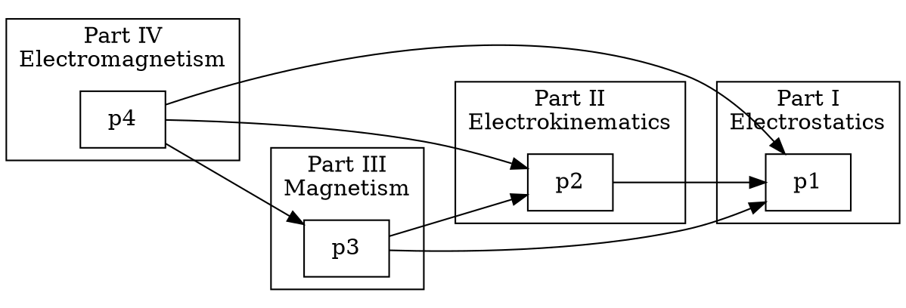

# Command: check-dependencies

## Description

Verifies cross-part dependency chains across the Maxwell Treatise architecture. This command analyzes which Parts depend on which other Parts, detects circular dependencies, and ensures the layered architecture maintains proper separation of concerns.

## Usage

```bash
architectus check-dependencies [OPTIONS]

Options:
  --part <PART>           Check dependencies for specific part
  --graph                 Output dependency graph (DOT format)
  --critical              Show only critical (breaking) dependencies
  --verify                Verify all declared dependencies exist
  --output <FORMAT>       Output format: text, json, dot, markdown (default: text)
  --report <PATH>         Write dependency report to file
```

## Input

- **Architecture COMPLETE Documents**: All 6 Part architecture maps
- **Module Registry**: Inter-module dependency declarations
- **Import Graph**: Python import statements analysis

## Dependency Types

### 1. Cross-Part Dependencies

Dependencies between major parts:
- **Part IV → Parts I, II, III**: Electromagnetism requires Electrostatics, Electrokinematics, and Magnetism
- **Part V → All Parts**: System Core requires all domain parts
- **Part VI → Parts I-V**: Scalar Physics builds on all previous parts

### 2. Inter-Module Dependencies

Dependencies between specific modules:
- `maxwell/physics/fields.py` → `maxwell/core/units.py`
- `maxwell/solvers/greens.py` → `maxwell/physics/potential.py`
- `maxwell/magnetics/induction.py` → `maxwell/kinematics/current.py`

### 3. Layer Dependencies

Dependencies between layers:
- Layer 4 (Solvers) → Layer 2 (Physics Engine)
- Layer 8 (Spherical Harmonics) → Layer 0 (Configuration)

## Dependency Graph

### Expected Dependency Structure

```
Part VI (Scalar Physics)
    └── Parts I, II, III, IV, V
        ├── Part V (System Core)
        │   └── Parts I, II, III, IV
        │       ├── Part IV (Electromagnetism)
        │       │   └── Parts I, II, III
        │       ├── Part III (Magnetism)
        │       │   └── Parts I, II
        │       ├── Part II (Electrokinematics)
        │       │   └── Part I
        │       └── Part I (Electrostatics)
        └── Foundation (math, core, config)
```

### Dependency Matrix

| From Part | To Part I | To Part II | To Part III | To Part IV | To Part V |
|-----------|-----------|------------|-------------|------------|-----------|
| Part I | - | No | No | No | No |
| Part II | Yes | - | No | No | No |
| Part III | Yes | Yes | - | No | No |
| Part IV | Yes | Yes | Yes | - | No |
| Part V | Yes | Yes | Yes | Yes | - |
| Part VI | Yes | Yes | Yes | Yes | Yes |

## Validation Checks

### 1. Circular Dependency Detection

- [ ] No circular dependencies exist
- [ ] Dependency graph is a DAG (Directed Acyclic Graph)
- [ ] Layer ordering is respected

### 2. Dependency Declaration Validation

- [ ] All cross-part imports are declared
- [ ] Declared dependencies match actual imports
- [ ] Bridge modules properly documented

### 3. Dependency Impact Analysis

- [ ] Changes in Part I propagation analysis
- [ ] Breaking change identification
- [ ] Downstream impact assessment

## Output

### Summary Output

```
Cross-Part Dependency Check
===========================

Dependency Analysis:
  Part I (Electrostatics): No dependencies on other parts
  Part II (Electrokinematics): Depends on Part I
  Part III (Magnetism): Depends on Parts I, II
  Part IV (Electromagnetism): Depends on Parts I, II, III
  Part V (System Core): Depends on Parts I, II, III, IV
  Part VI (Scalar Physics): Depends on Parts I, II, III, IV, V

Circular Dependencies: NONE
Undeclared Dependencies: NONE
Missing Dependencies: NONE

Status: VALIDATED
```

### Dependency Graph Output (DOT)



### Critical Dependencies Output

```
Critical Dependencies (Breaking Changes)
=========================================

Part IV → Part I:
  maxwell/em/induction.py imports:
    - maxwell/core/fields.py [CRITICAL]
    - maxwell/physics/potential.py [CRITICAL]

Part VI → Part IV:
  maxwell/scalar/waves.py imports:
    - maxwell/em/maxwell_equations.py [CRITICAL]
    - maxwell/em/wave_propagation.py [CRITICAL]

Total Critical Dependencies: 4
```

## Exit Codes

| Code | Meaning |
|------|---------|
| 0 | Dependencies validated, no issues |
| 1 | Circular dependencies detected |
| 2 | Undeclared dependencies found |
| 3 | Missing dependencies detected |

## Examples

```bash
# Full dependency check
architectus check-dependencies

# Check specific part
architectus check-dependencies --part IV

# Generate dependency graph
architectus check-dependencies --graph --report dependencies.dot

# Verify declared dependencies
architectus check-dependencies --verify

# Show only critical dependencies
architectus check-dependencies --critical
```

## Related Commands

- `validate-architecture` - Overall architecture validation
- `sync-agents` - Agent synchronization after dependency changes
- `pipeline-orchestrate` - Pipeline ordering based on dependencies

## Integration

### CI/CD Pipeline

```yaml
- name: Dependency Check
  run: architectus check-dependencies --verify --output json --report deps.json
  
- name: Detect Circular Dependencies
  run: |
    circular=$(jq '.circular_dependencies | length' deps.json)
    if [ "$circular" -gt 0 ]; then
      echo "Circular dependencies detected!"
      jq '.circular_dependencies' deps.json
      exit 1
    fi
```

### Impact Analysis

When a module changes, this command can identify affected modules:

```bash
# What breaks if core/fields.py changes?
architectus check-dependencies --affected-by core/fields.py
```

## Implementation Notes

This command:
1. Parses all architecture COMPLETE documents
2. Extracts dependency declarations
3. Analyzes Python import statements
4. Builds dependency graph
5. Performs cycle detection (Tarjan's algorithm)
6. Generates impact analysis reports

## Dependency Categories

| Category | Description | Example |
|----------|-------------|---------|
| CRITICAL | Breaking dependency - cannot function without | EM equations → Maxwell's equations |
| FUNCTIONAL | Core functionality dependency | Field solver → Potential module |
| OPTIONAL | Enhanced functionality | Visualization → Field module |
| TEST | Test-only dependency | Test suite → Implementation |

## Change Propagation

When a module changes:
1. Direct dependents are notified
2. Transitive dependents are identified
3. Impact severity is assessed
4. Regression test requirements are determined
