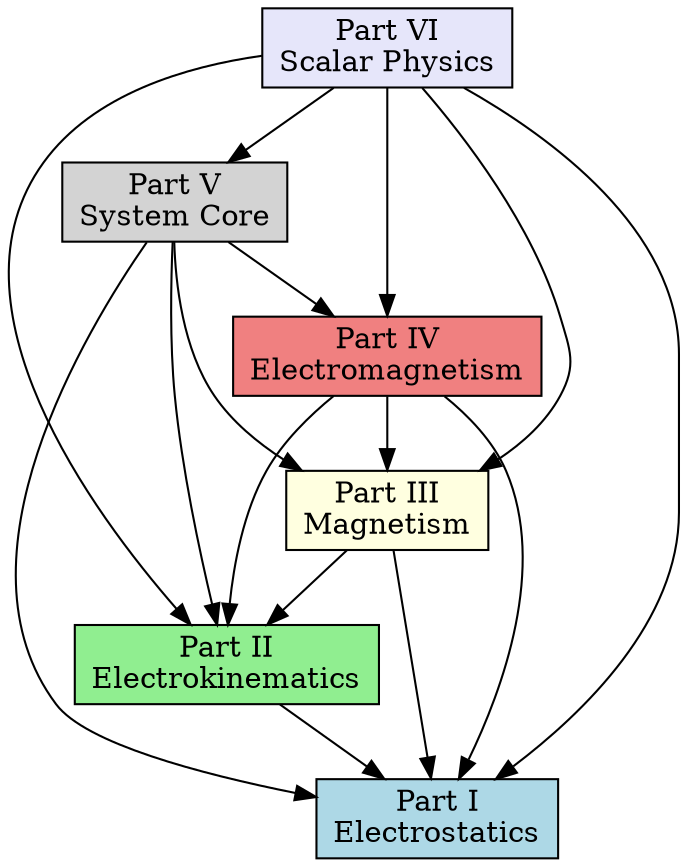

# Data: Cross-Part Dependency Graph

## Description

Authoritative reference for cross-part dependencies between the 6 Parts of Maxwell's Treatise. This document defines which Parts depend on which other Parts and the nature of those dependencies.

---

## Dependency Matrix

### Part-to-Part Dependencies

| From \ To | Part I | Part II | Part III | Part IV | Part V | Part VI |
|-----------|--------|---------|----------|---------|--------|---------|
| **Part I** (Electrostatics) | — | No | No | No | No | No |
| **Part II** (Electrokinematics) | Yes | — | No | No | No | No |
| **Part III** (Magnetism) | Yes | Yes | — | No | No | No |
| **Part IV** (Electromagnetism) | Yes | Yes | Yes | — | No | No |
| **Part V** (System Core) | Yes | Yes | Yes | Yes | — | No |
| **Part VI** (Scalar Physics) | Yes | Yes | Yes | Yes | Yes | — |

### Dependency Count

| Part | Dependencies On | Dependents |
|------|-----------------|------------|
| Part I | 0 | 5 (II, III, IV, V, VI) |
| Part II | 1 (I) | 4 (III, IV, V, VI) |
| Part III | 2 (I, II) | 3 (IV, V, VI) |
| Part IV | 3 (I, II, III) | 2 (V, VI) |
| Part V | 4 (I, II, III, IV) | 1 (VI) |
| Part VI | 5 (I, II, III, IV, V) | 0 |

---

## Detailed Dependencies

### Part I: Electrostatics (Foundation)

**Dependencies:** None (foundation layer)

**Provides To:**
- Part II: Charge, field, potential fundamentals
- Part III: Magnetic potential analogy
- Part IV: Electric field in Maxwell's equations
- Part V: System-wide field types
- Part VI: Wave equation foundations

**Key Modules Provided:**
- `maxwell/core/charge.py` — Charge fundamentals
- `maxwell/core/fields.py` — Electric field definitions
- `maxwell/physics/potential.py` — Potential theory
- `maxwell/physics/poisson.py` — Poisson/Laplace equations

---

### Part II: Electrokinematics

**Dependencies On:**
- Part I: Electric field, potential, charge

**Provides To:**
- Part III: Current-magnetic field relationship
- Part IV: Current density in Maxwell's equations
- Part V: Circuit simulation components
- Part VI: Current sources in wave equations

**Key Modules Used from Part I:**
- `maxwell/core/fields.py` — Electric field
- `maxwell/physics/potential.py` — EMF from potential

**Key Modules Provided:**
- `maxwell/kinematics/current.py` — Electric current
- `maxwell/physics/ohm.py` — Ohm's law
- `maxwell/chemistry/electrolysis.py` — Ionic conduction

---

### Part III: Magnetism

**Dependencies On:**
- Part I: Potential theory, field concepts
- Part II: Current as source of magnetic field

**Provides To:**
- Part IV: Magnetic field in Maxwell's equations
- Part V: Magnetic material models
- Part VI: Magnetic wave propagation

**Key Modules Used from Part I:**
- `maxwell/physics/potential.py` — Scalar potential

**Key Modules Used from Part II:**
- `maxwell/kinematics/current.py` — Current sources

**Key Modules Provided:**
- `maxwell/magnetics/fields.py` — Magnetic field
- `maxwell/magnetics/potential.py` — Magnetic potential
- `maxwell/magnetics/induction.py` — Magnetic induction

---

### Part IV: Electromagnetism

**Dependencies On:**
- Part I: Electric field, potential, stress tensor
- Part II: Current, conduction
- Part III: Magnetic field, induction

**Provides To:**
- Part V: Maxwell's equations solver
- Part VI: Electromagnetic wave theory

**Key Modules Used from Part I:**
- `maxwell/core/fields.py` — Electric field
- `maxwell/analysis/stress.py` — Stress tensor

**Key Modules Used from Part II:**
- `maxwell/kinematics/current.py` — Current density
- `maxwell/physics/ohm.py` — Conductivity

**Key Modules Used from Part III:**
- `maxwell/magnetics/fields.py` — Magnetic field
- `maxwell/magnetics/induction.py` — Induction

**Key Modules Provided:**
- `maxwell/em/maxwell_equations.py` — Complete Maxwell's equations
- `maxwell/em/induction.py` — Electromagnetic induction
- `maxwell/em/wave_propagation.py` — EM wave propagation

---

### Part V: System Core

**Dependencies On:**
- Part I: Field types, units
- Part II: Circuit models
- Part III: Magnetic materials
- Part IV: Maxwell's equations

**Provides To:**
- Part VI: System infrastructure

**Key Modules Used:**
- From Part I: `maxwell/core/units.py`, `maxwell/core/fields.py`
- From Part II: `maxwell/kinematics/current.py`
- From Part III: `maxwell/magnetics/materials.py`
- From Part IV: `maxwell/em/maxwell_equations.py`

**Key Modules Provided:**
- `maxwell/core/system/init.py` — System initialization
- `maxwell/core/system/pipeline.py` — Simulation pipeline
- `maxwell/core/system/config.py` — Configuration management

---

### Part VI: Scalar Physics

**Dependencies On:**
- Part I: Wave equation foundations
- Part II: Source terms
- Part III: Magnetic wave components
- Part IV: EM wave theory
- Part V: System infrastructure

**Key Modules Used:**
- From Part I: `maxwell/physics/poisson.py`
- From Part II: `maxwell/kinematics/sources.py`
- From Part III: `maxwell/magnetics/fields.py`
- From Part IV: `maxwell/em/wave_propagation.py`
- From Part V: `maxwell/core/system/pipeline.py`

**Key Modules Provided:**
- `maxwell/scalar/waves.py` — Wave theory
- `maxwell/scalar/pde.py` — PDE solvers
- `maxwell/scalar/radiation.py` — Radiation theory

---

## Bridge Modules

### Part II → Part III Bridge

**Module:** `maxwell/magnetics/coupling.py`

**Purpose:** Connect electric current to magnetic field (Ampère's law)

**Imports:**
- From Part II: `maxwell/kinematics/current.py`
- To Part III: `maxwell/magnetics/fields.py`

---

### Part III → Part IV Bridge

**Module:** `maxwell/em/induction.py`

**Purpose:** Connect changing magnetic field to electric field (Faraday's law)

**Imports:**
- From Part III: `maxwell/magnetics/induction.py`
- To Part IV: `maxwell/em/maxwell_equations.py`

---

### Part IV → Part V Bridge

**Module:** `maxwell/core/system/em_interface.py`

**Purpose:** Provide Maxwell's equations to system core

**Imports:**
- From Part IV: `maxwell/em/maxwell_equations.py`
- To Part V: `maxwell/core/system/pipeline.py`

---

## Dependency Graph Visualization

### Text Representation

```
                    Part VI (Scalar Physics)
                           ↑
                    Part V (System Core)
                           ↑
                    Part IV (Electromagnetism)
                   ↗         ↑         ↖
            Part I      Part II       Part III
            (Electrostatics)  (Electrokinematics)  (Magnetism)
                   ↖         ↑         ↗
                    All depend on Part I (Foundation)
```

### GraphViz DOT Format



---

## Circular Dependency Analysis

### Analysis Result

**Status:** NO CIRCULAR DEPENDENCIES DETECTED

**Graph Type:** DAG (Directed Acyclic Graph)

**Verification Method:** Topological sort

**Topological Order:**
1. Part I (Electrostatics)
2. Part II (Electrokinematics)
3. Part III (Magnetism)
4. Part IV (Electromagnetism)
5. Part V (System Core)
6. Part VI (Scalar Physics)

---

## Change Impact Analysis

### If Part I Changes

| Affected Part | Impact Level | Modules Affected | Action Required |
|---------------|--------------|------------------|-----------------|
| Part II | High | 100% | Update imports, revalidate |
| Part III | High | 100% | Update imports, revalidate |
| Part IV | High | 100% | Update imports, revalidate |
| Part V | Medium | 80% | Update imports, revalidate |
| Part VI | High | 100% | Update imports, revalidate |

### If Part IV Changes

| Affected Part | Impact Level | Modules Affected | Action Required |
|---------------|--------------|------------------|-----------------|
| Part V | Medium | 40% | Update imports, revalidate |
| Part VI | Medium | 30% | Update imports, revalidate |

---

## Version History

| Version | Date | Changes |
|---------|------------|---------|
| 2.0 | 2026-01-15 | Complete dependency graph revision |
| 1.5 | 2025-11-15 | Added Part V dependencies |
| 1.0 | 2025-01-01 | Initial dependency graph (Parts I-IV) |

---

**END OF DOCUMENT**
