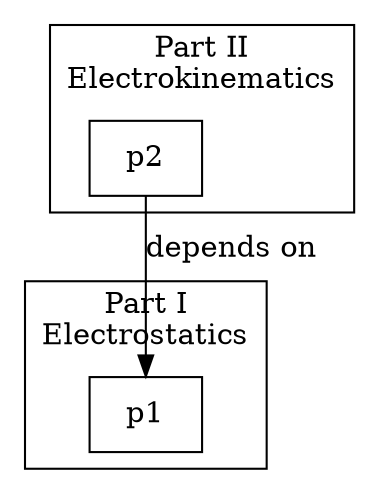

# Template: Dependency Map

## Description

Template for documenting cross-part dependencies between modules and Parts of Maxwell's Treatise. This template ensures clear documentation of which components depend on which other components.

## Structure

```markdown
# Cross-Part Dependency Map

## Overview

**Document Version:** {VERSION}  
**Last Updated:** {DATE}  
**Architecture Version:** {ARCH_VERSION}

This document describes the dependencies between Parts and modules in the Maxwell Treatise modernization architecture.

---

## Dependency Matrix

### Part-to-Part Dependencies

| From Part | To Part I | To Part II | To Part III | To Part IV | To Part V | To Part VI |
|-----------|-----------|------------|-------------|------------|-----------|------------|
| Part I    | —         | No         | No          | No         | No        | No         |
| Part II   | Yes       | —          | No          | No         | No        | No         |
| Part III  | Yes       | Yes        | —           | No         | No        | No         |
| Part IV   | Yes       | Yes        | Yes         | —          | No        | No         |
| Part V    | Yes       | Yes        | Yes         | Yes        | —         | No         |
| Part VI   | Yes       | Yes        | Yes         | Yes        | Yes       | —          |

---

## Detailed Dependencies

### Part {N} Dependencies

#### Declared Dependencies

Part {N} ({PART_NAME}) depends on:
- **Part I (Electrostatics)**: {REASON}
- **Part II (Electrokinematics)**: {REASON}
- ...

#### Module-Level Dependencies

```python
# maxwell/{package}/{module}.py

from maxwell.core.fields import ElectricField      # Part I, Layer 4
from maxwell.physics.potential import calc_potential  # Part I, Layer 2
```

| Module | Depends On | Type | Critical |
|--------|------------|------|----------|
| `{MODULE}` | `{DEPENDENCY}` | {TYPE} | {YES/NO} |

#### Import Dependencies

```
maxwell/{package}/{module}.py
├── maxwell/core/fields.py (Layer 4)
├── maxwell/physics/potential.py (Layer 2)
└── maxwell/math/spherical/harmonics.py (Layer 8)
```

---

## Bridge Modules

### Part {N} → Part {M} Bridge

**Module:** `maxwell/{bridge_module}.py`  
**Purpose:** {Description of bridge purpose}

**Provides:**
- `{FUNCTION}` - Used by Part {M}

**Requires:**
- `{DEPENDENCY}` - From Part {N}

---

## Dependency Graph

### Visual Representation

```
Part VI (Scalar Physics)
    ↓
Part V (System Core)
    ↓
Part IV (Electromagnetism)
    ↓
Part III (Magnetism)
    ↓
Part II (Electrokinematics)
    ↓
Part I (Electrostatics) ← Foundation
```

### GraphViz Format



---

## Dependency Categories

### Critical Dependencies

These dependencies are breaking - the dependent module cannot function without them:

| Dependent | Dependency | Reason |
|-----------|------------|--------|
| `{MODULE}` | `{DEPENDENCY}` | {REASON} |

### Functional Dependencies

These dependencies provide core functionality:

| Dependent | Dependency | Reason |
|-----------|------------|--------|
| `{MODULE}` | `{DEPENDENCY}` | {REASON} |

### Optional Dependencies

These dependencies provide enhanced functionality:

| Dependent | Dependency | Reason |
|-----------|------------|--------|
| `{MODULE}` | `{DEPENDENCY}` | {REASON} |

---

## Change Impact Analysis

### If Part I Changes

| Affected Part | Impact Level | Modules Affected | Action Required |
|---------------|--------------|------------------|-----------------|
| Part II | High | {COUNT} | {ACTION} |
| Part III | High | {COUNT} | {ACTION} |
| Part IV | High | {COUNT} | {ACTION} |
| Part V | Medium | {COUNT} | {ACTION} |
| Part VI | Medium | {COUNT} | {ACTION} |

---

## Validation Status

- [ ] All dependencies declared
- [ ] No circular dependencies
- [ ] All import paths valid
- [ ] Bridge modules documented
- [ ] Impact analysis complete

---

## Version History

| Version | Date | Changes |
|---------|------------|---------|
| {VERSION} | {DATE} | {CHANGES} |

---

**END OF DOCUMENT**
```

## Variables

| Variable | Description | Example |
|----------|-------------|---------|
| `{VERSION}` | Document version | 1.0 |
| `{DATE}` | Last updated date | 2026-04-11 |
| `{ARCH_VERSION}` | Architecture version | 2.0.0 |
| `{PART_NAME}` | Part name | Electrostatics |
| `{MODULE}` | Module path | maxwell/core/fields.py |
| `{DEPENDENCY}` | Dependency path | maxwell/core/units.py |
| `{TYPE}` | Dependency type | import, functional |
| `{REASON}` | Dependency reason | Required for unit conversion |

## Usage Instructions

1. Copy this template to new dependency document
2. Fill in dependency matrix for all Parts
3. Document module-level dependencies
4. Identify and document bridge modules
5. Create dependency graph visualization
6. Categorize dependencies by criticality
7. Complete change impact analysis
8. Validate all dependencies

## Related Templates

- `architecture-document.md` - Architecture documentation template
- `agent-coordination.md` - Agent coordination template

## Example Dependency Entry

```markdown
### Part IV Dependencies

#### Declared Dependencies

Part IV (Electromagnetism) depends on:
- **Part I (Electrostatics)**: Electric field and potential foundations
- **Part II (Electrokinematics)**: Current flow and conduction
- **Part III (Magnetism)**: Magnetic field and induction

#### Module-Level Dependencies

| Module | Depends On | Type | Critical |
|--------|------------|------|----------|
| `maxwell/em/induction.py` | `maxwell/magnetics/fields.py` | import | Yes |
| `maxwell/em/maxwell_equations.py` | `maxwell/core/fields.py` | import | Yes |
| `maxwell/em/wave_propagation.py` | `maxwell/physics/potential.py` | functional | No |
```
