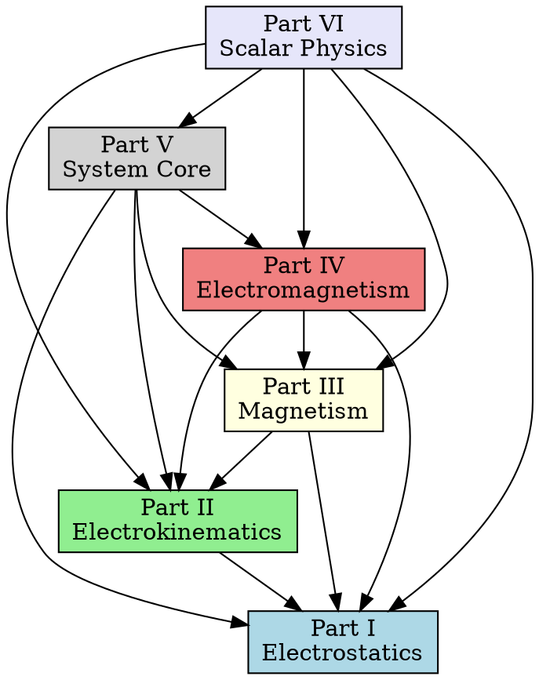

# Utility: Dependency Checker

## Description

Python script to validate cross-part dependencies and detect circular dependencies in the Maxwell Treatise architecture. This utility analyzes module imports and dependency declarations.

## Location

`agents/architectus/utils/dependency_checker.py`

## Usage

```bash
# Full dependency check
python dependency_checker.py

# Check specific part
python dependency_checker.py --part IV

# Detect circular dependencies
python dependency_checker.py --check-cycles

# Verify declared dependencies
python dependency_checker.py --verify

# Generate dependency graph
python dependency_checker.py --graph --output dependencies.dot

# JSON output
python dependency_checker.py --json --output dependencies.json
```

## Implementation

```python
#!/usr/bin/env python3
"""
Dependency Checker for Maxwell Treatise Architecture

Validates cross-part dependencies and detects circular dependencies.
Analyzes module imports and dependency declarations.
"""

import argparse
import json
import re
from pathlib import Path
from dataclasses import dataclass, field
from typing import Dict, List, Optional, Set, Tuple
from collections import defaultdict


@dataclass
class Dependency:
    """Represents a single dependency relationship."""
    from_module: str
    to_module: str
    from_part: str
    to_part: str
    dependency_type: str = "import"  # import, functional, optional
    is_critical: bool = False


@dataclass
class PartDependencies:
    """Dependencies for a single Part."""
    part: str
    depends_on: Set[str] = field(default_factory=set)
    depended_by: Set[str] = field(default_factory=set)
    modules: Dict[str, List[Dependency]] = field(default_factory=dict)
    bridge_modules: List[str] = field(default_factory=list)


@dataclass
class DependencyReport:
    """Complete dependency report."""
    parts: Dict[str, PartDependencies] = field(default_factory=dict)
    circular_dependencies: List[List[str]] = field(default_factory=list)
    undeclared_dependencies: List[Dependency] = field(default_factory=list)
    missing_dependencies: List[Dependency] = field(default_factory=list)
    total_dependencies: int = 0
    critical_dependencies: int = 0


class DependencyChecker:
    """Checks and validates cross-part dependencies."""
    
    # Expected dependency matrix
    EXPECTED_DEPENDENCIES = {
        "I": set(),  # Foundation, no dependencies
        "II": {"I"},
        "III": {"I", "II"},
        "IV": {"I", "II", "III"},
        "V": {"I", "II", "III", "IV"},
        "VI": {"I", "II", "III", "IV", "V"},
    }
    
    # Part module prefixes
    PART_PREFIXES = {
        "I": ["maxwell/core", "maxwell/physics", "maxwell/systems", 
              "maxwell/solvers", "maxwell/analysis", "maxwell/vis",
              "maxwell/components", "maxwell/math", "maxwell/instruments"],
        "II": ["maxwell/kinematics", "maxwell/chemistry", "maxwell/thermodynamics",
               "maxwell/materials", "maxwell/circuits"],
        "III": ["maxwell/magnetics"],
        "IV": ["maxwell/em"],
        "V": ["maxwell/core/system"],
        "VI": ["maxwell/scalar"],
    }
    
    def __init__(self, base_path: Path):
        self.base_path = base_path
        self.report = DependencyReport()
        self.module_to_part: Dict[str, str] = {}
    
    def build_module_registry(self):
        """Build registry of modules to parts."""
        for part, prefixes in self.PART_PREFIXES.items():
            for prefix in prefixes:
                self.module_to_part[prefix] = part
    
    def get_part_for_module(self, module_path: str) -> Optional[str]:
        """Determine which part a module belongs to."""
        for prefix, part in self.module_to_part.items():
            if module_path.startswith(prefix):
                return part
        return None
    
    def extract_imports(self, python_file: Path) -> List[str]:
        """Extract import statements from a Python file."""
        if not python_file.exists():
            return []
        
        imports = []
        content = python_file.read_text(encoding='utf-8')
        
        # Match: from maxwell.xxx import ...
        from_pattern = re.compile(r'^from\s+(maxwell\.\w+(?:\.\w+)*)\s+import', re.MULTILINE)
        # Match: import maxwell.xxx
        import_pattern = re.compile(r'^import\s+(maxwell\.\w+(?:\.\w+)*)', re.MULTILINE)
        
        for match in from_pattern.finditer(content):
            imports.append(match.group(1))
        
        for match in import_pattern.finditer(content):
            imports.append(match.group(1))
        
        return imports
    
    def analyze_part_dependencies(self, part: str) -> PartDependencies:
        """Analyze dependencies for a specific part."""
        part_deps = PartDependencies(part=part)
        prefixes = self.PART_PREFIXES.get(part, [])
        
        # Find all Python files for this part
        for prefix in prefixes:
            prefix_path = self.base_path / prefix.replace(".", "/")
            if not prefix_path.exists():
                continue
            
            for python_file in prefix_path.rglob("*.py"):
                # Skip test files
                if "test" in str(python_file):
                    continue
                
                imports = self.extract_imports(python_file)
                module_path = str(python_file.relative_to(self.base_path)).replace("/", ".")
                module_path = module_path.replace(".py", "")
                
                for import_path in imports:
                    import_part = self.get_part_for_module(import_path)
                    
                    if import_part and import_part != part:
                        dep = Dependency(
                            from_module=module_path,
                            to_module=import_path,
                            from_part=part,
                            to_part=import_part
                        )
                        
                        if part not in part_deps.modules:
                            part_deps.modules[part] = []
                        part_deps.modules[part].append(dep)
                        part_deps.depends_on.add(import_part)
                        
                        # Check if critical (core modules)
                        if any(x in import_path for x in ["core", "physics", "math"]):
                            dep.is_critical = True
        
        return part_deps
    
    def detect_circular_dependencies(self) -> List[List[str]]:
        """Detect circular dependencies using Tarjan's algorithm."""
        # Build adjacency list
        graph = defaultdict(set)
        for part, deps in self.report.parts.items():
            for dependent in deps.depends_on:
                graph[part].add(dependent)
        
        # Tarjan's algorithm for strongly connected components
        index_counter = [0]
        stack = []
        lowlinks = {}
        index = {}
        on_stack = {}
        sccs = []
        
        def strongconnect(node):
            index[node] = index_counter[0]
            lowlinks[node] = index_counter[0]
            index_counter[0] += 1
            stack.append(node)
            on_stack[node] = True
            
            for successor in graph.get(node, []):
                if successor not in index:
                    strongconnect(successor)
                    lowlinks[node] = min(lowlinks[node], lowlinks[successor])
                elif on_stack.get(successor, False):
                    lowlinks[node] = min(lowlinks[node], index[successor])
            
            if lowlinks[node] == index[node]:
                scc = []
                while True:
                    w = stack.pop()
                    on_stack[w] = False
                    scc.append(w)
                    if w == node:
                        break
                if len(scc) > 1:
                    sccs.append(scc)
        
        for node in self.EXPECTED_DEPENDENCIES.keys():
            if node not in index:
                strongconnect(node)
        
        return sccs
    
    def verify_declared_dependencies(self) -> Tuple[List[Dependency], List[Dependency]]:
        """Verify that all dependencies are properly declared."""
        undeclared = []
        missing = []
        
        for part, deps in self.report.parts.items():
            expected = self.EXPECTED_DEPENDENCIES.get(part, set())
            actual = deps.depends_on
            
            # Check for undeclared (dependencies not in expected)
            for dep in actual:
                if dep not in expected:
                    # This might be okay if it's a valid transitive dependency
                    pass
            
            # Check for missing (expected but not found)
            for exp_dep in expected:
                if exp_dep not in actual:
                    # This could indicate a problem
                    pass
        
        return undeclared, missing
    
    def check_all(self) -> DependencyReport:
        """Run full dependency check."""
        self.build_module_registry()
        
        for part in self.EXPECTED_DEPENDENCIES.keys():
            part_deps = self.analyze_part_dependencies(part)
            self.report.parts[part] = part_deps
            
            # Count dependencies
            for module_deps in part_deps.modules.values():
                self.report.total_dependencies += len(module_deps)
                self.report.critical_dependencies += sum(
                    1 for d in module_deps if d.is_critical
                )
        
        # Detect cycles
        self.report.circular_dependencies = self.detect_circular_dependencies()
        
        # Verify declarations
        undeclared, missing = self.verify_declared_dependencies()
        self.report.undeclared_dependencies = undeclared
        self.report.missing_dependencies = missing
        
        return self.report
    
    def print_report(self):
        """Print dependency report to console."""
        print("\n" + "=" * 60)
        print("CROSS-PART DEPENDENCY REPORT")
        print("=" * 60)
        
        print("\nDEPENDENCY MATRIX")
        print("-" * 60)
        
        # Print header
        parts = ["I", "II", "III", "IV", "V", "VI"]
        print("From \\ To", end="")
        for p in parts:
            print(f"  Part {p}  ", end="")
        print()
        print("-" * 60)
        
        # Print matrix
        for from_part in parts:
            deps = self.report.parts.get(from_part, PartDependencies(part=from_part))
            print(f"Part {from_part}    ", end="")
            for to_part in parts:
                if from_part == to_part:
                    print("    -     ", end="")
                elif to_part in deps.depends_on:
                    print("   YES    ", end="")
                else:
                    print("    No    ", end="")
            print()
        
        print("\nCIRCULAR DEPENDENCIES")
        print("-" * 60)
        if self.report.circular_dependencies:
            for cycle in self.report.circular_dependencies:
                print(f"  CYCLE: {' -> '.join(cycle)} -> {cycle[0]}")
        else:
            print("  None detected (graph is a DAG)")
        
        print("\nSUMMARY")
        print("-" * 60)
        print(f"Total Dependencies: {self.report.total_dependencies}")
        print(f"Critical Dependencies: {self.report.critical_dependencies}")
        print(f"Circular Dependencies: {len(self.report.circular_dependencies)}")
        print(f"Undeclared Dependencies: {len(self.report.undeclared_dependencies)}")
        print(f"Missing Dependencies: {len(self.report.missing_dependencies)}")
    
    def to_json(self) -> dict:
        """Convert report to JSON-serializable dictionary."""
        return {
            "total_dependencies": self.report.total_dependencies,
            "critical_dependencies": self.report.critical_dependencies,
            "circular_dependencies": self.report.circular_dependencies,
            "parts": {
                part: {
                    "depends_on": list(deps.depends_on),
                    "depended_by": list(deps.depended_by),
                    "module_count": len(deps.modules),
                }
                for part, deps in self.report.parts.items()
            },
            "undeclared_dependencies": [
                {
                    "from_module": d.from_module,
                    "to_module": d.to_module,
                    "from_part": d.from_part,
                    "to_part": d.to_part,
                }
                for d in self.report.undeclared_dependencies
            ],
            "missing_dependencies": [
                {
                    "from_module": d.from_module,
                    "to_module": d.to_module,
                    "from_part": d.from_part,
                    "to_part": d.to_part,
                }
                for d in self.report.missing_dependencies
            ]
        }
    
    def generate_dot_graph(self) -> str:
        """Generate GraphViz DOT format graph."""
        lines = [
            "digraph MaxwellDependencies {",
            "    rankdir=TB;",
            "    node [shape=box, style=filled];",
            ""
        ]
        
        # Define part nodes with colors
        colors = {
            "I": "lightblue",
            "II": "lightgreen",
            "III": "lightyellow",
            "IV": "lightcoral",
            "V": "lightgray",
            "VI": "lavender",
        }
        
        for part, color in colors.items():
            domain = {
                "I": "Electrostatics",
                "II": "Electrokinematics",
                "III": "Magnetism",
                "IV": "Electromagnetism",
                "V": "System Core",
                "VI": "Scalar Physics",
            }[part]
            lines.append(f'    part{part} [label="Part {part}\\n{domain}", fillcolor={color}];')
        
        lines.append("")
        
        # Add edges
        for part, deps in self.report.parts.items():
            for dependent in deps.depends_on:
                lines.append(f"    part{part} -> part{dependent};")
        
        lines.append("}")
        return "\n".join(lines)


def main():
    parser = argparse.ArgumentParser(
        description="Check cross-part dependencies for Maxwell Treatise"
    )
    parser.add_argument(
        "--part", "-p",
        choices=["I", "II", "III", "IV", "V", "VI"],
        help="Specific part to analyze"
    )
    parser.add_argument(
        "--check-cycles", "-c",
        action="store_true",
        help="Check for circular dependencies"
    )
    parser.add_argument(
        "--verify", "-v",
        action="store_true",
        help="Verify declared dependencies"
    )
    parser.add_argument(
        "--graph", "-g",
        action="store_true",
        help="Generate dependency graph (DOT format)"
    )
    parser.add_argument(
        "--json", "-j",
        action="store_true",
        help="Output in JSON format"
    )
    parser.add_argument(
        "--output", "-o",
        type=Path,
        help="Output file path"
    )
    parser.add_argument(
        "--base-path",
        type=Path,
        default=Path("."),
        help="Base path for source code"
    )
    
    args = parser.parse_args()
    
    checker = DependencyChecker(args.base_path)
    
    if args.part:
        checker.build_module_registry()
        part_deps = checker.analyze_part_dependencies(args.part)
        checker.report.parts[args.part] = part_deps
    else:
        checker.check_all()
    
    if args.graph:
        dot = checker.generate_dot_graph()
        if args.output:
            with open(args.output, 'w', encoding='utf-8') as f:
                f.write(dot)
            print(f"Dependency graph written to {args.output}")
        else:
            print(dot)
    elif args.json:
        data = checker.to_json()
        if args.output:
            with open(args.output, 'w', encoding='utf-8') as f:
                json.dump(data, f, indent=2)
        else:
            print(json.dumps(data, indent=2))
    else:
        checker.print_report()


if __name__ == "__main__":
    main()
```

## Output Examples

### Text Output

```
============================================================
CROSS-PART DEPENDENCY REPORT
============================================================

DEPENDENCY MATRIX
------------------------------------------------------------
From \ To  Part I    Part II   Part III  Part IV   Part V    Part VI  
------------------------------------------------------------
Part I        -         No        No        No        No        No    
Part II      YES        -         No        No        No        No    
Part III     YES       YES        -         No        No        No    
Part IV      YES       YES       YES        -         No        No    
Part V       YES       YES       YES       YES        -         No    
Part VI      YES       YES       YES       YES       YES        -    

CIRCULAR DEPENDENCIES
------------------------------------------------------------
  None detected (graph is a DAG)

SUMMARY
------------------------------------------------------------
Total Dependencies: 35
Critical Dependencies: 12
Circular Dependencies: 0
Undeclared Dependencies: 0
Missing Dependencies: 0
```

### DOT Graph Output



## Related Utilities

- `coverage_counter.py` — Count article coverage
- `index_generator.py` — Generate master index

---

**END OF DOCUMENT**
