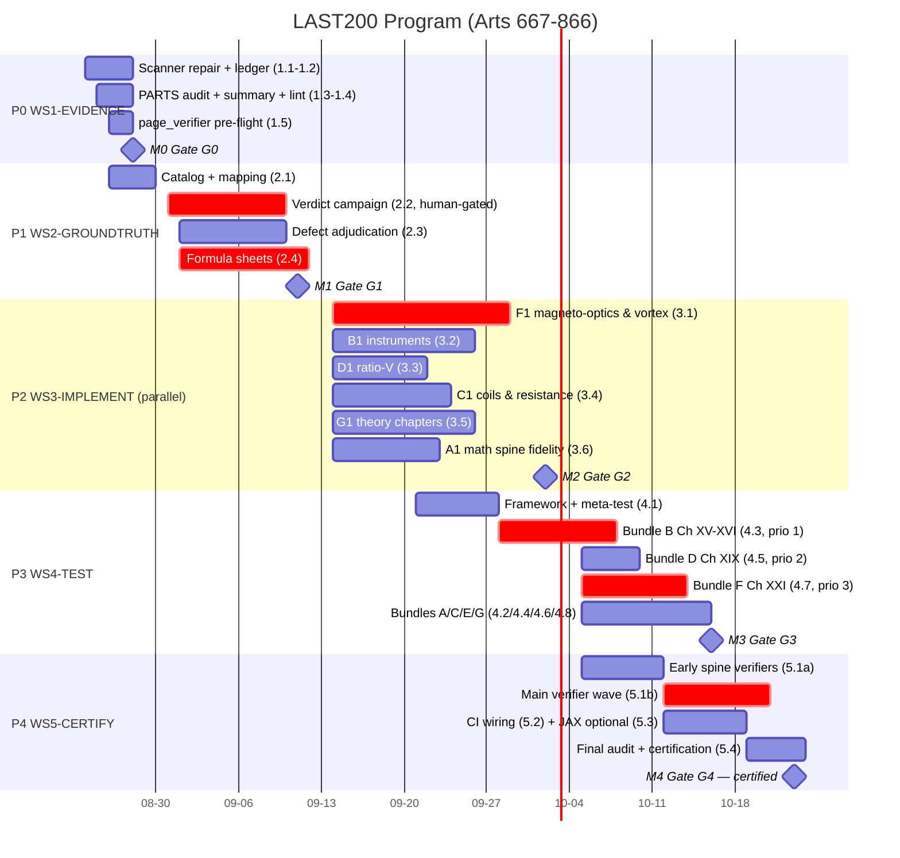

# LAST 200 ARTICLES (667-866) — Stage 2 Program Management Plan

**Program Name:** Maxwell Last-200 Assurance & Hardening Program ("LAST200")
**Pipeline stage:** 2 of 4 (Software Program Management)
**Date:** 2026-08-21
**Author:** Software Program Manager (Stage 2 agent)
**Primary input:** `docs/LAST200_STAGE1_PLANNING_ANALYSIS.md` (Stage 1, 2026-08-21)
**Scope:** Part IV, Ch XII tail (Arts. 667-674) through Ch XXIII (Arts. 846-866) — 200 articles
**Duration:** ~9 calendar weeks (2026-08-24 → 2026-10-23), 5 phase gates
**Effort budget:** ~625 agent-hours direct + 15% contingency (ceiling ≈ 720 ah)
**Classification:** Internal — Program Governance

---

## 1. Program Charter

### 1.1 Mission

Convert the **citation coverage** of Articles 667-866 (currently 200/200 decorated) into **evidenced implementation depth**: every article must compute what the Treatise article actually states, with correct CGS mathematics, a passing named numeric test, and — for the mathematical spine — independent symbolic cross-validation and page-level ground truth. Stage 1 measured the last 200 articles at ~100% *cited*, ~90% *transcribed*, ~25% *numerically verified*, ~0.5% *cross-validated*. This program closes that gap.

### 1.2 Problem statement (from Stage 1, verified by Stage 2 read-only exploration)

| Evidence | Finding |
|---|---|
| Tier baseline | T0 ≈ 20 (10%), T1 ≈ 69 (34.5%), T2 ≈ 60 (30%), T3 ≈ 50 (25%), T4 = 1 (Art. 787) |
| Instrumentation | `check_coverage.py:89-90` — Ch XVII `(752,761)` overlaps Ch XVIII `(758,767)`; true Ch XVII = 752-757; scanner keys files by basename only and counts decorator presence without depth |
| Test evidence | 1,942 tests collect, but zero reference any article 667-866 by number; zero tests import `instruments/`, `galvanometers_extended.py`, `ratio_v/`, `waves/`, `magneto_optics/`, `vortex_engine/` and more; `tests/articles/` does not exist |
| Cross-validation | Of 15 registered SymPy verifiers (`verification/sympy_verify.py`, `article_refs` pattern), exactly 1 article in range (787) |
| Ground truth | `page_verifier/data/verdicts.json` holds 7 verdicts, all Vol I prelim pages; 0 for Vol II / 667-866 |
| Integrity | Verification theater: circular `verify_absolute_resistance`; hardcoded `"verified": True` in `philosophy/medium_check.py:255`; invented `experimental_agreement` scores in `molecular/competing_theories.py`; math-fidelity defects (4-term elliptic series duplicating the Landen implementation, Weber 1/2 coefficient, missing 4π/c² diffusion factor, Art. 829 docstring/code mismatch) |
| Documentation | `docs/COVERAGE_SUMMARY.md` stale and factually wrong (Part I "1-206", "Supplementary 796-866, 320 articles", 1795 tests) |

### 1.3 Scope

**In scope**
- Articles 667-866 inclusive (200 articles): Part IV Ch XII tail, XIII Parallel Currents, XIV Circular Currents, XV Electromagnetic Instruments, XVI Observations, XVII Coil Comparison, XVIII Resistance Unit, XIX ESU vs EMU, XX EM Theory of Light, XXI Magnetic Action on Light, XXII Molecular Currents, XXIII Action at Distance.
- Coverage-tool repair, evidence ledger, Vol II page-verifier ground-truth campaign, T0/T1→T2 implementation uplift, per-article numeric test bundles, SymPy spine verifiers, CI wiring, anti-theater static gate, documentation regeneration, certification.

**Out of scope** (parking-lot rule — see risk R13)
- Articles 1-666 (Parts I-III and Part IV Ch I-XI head). Defects discovered there during the audit are recorded in a parking-lot list for a post-program cycle, not fixed here.
- JAX ports as a requirement (optional cross-check only; Decision D-03).
- New visualization features beyond what an article's numeric core requires.
- Any modification of Category B (user-original theoretical extension) mathematics — see D-08 and §5.6.

### 1.4 Success definition — program exit criteria (all must hold at Gate G4)

| # | Exit criterion | Measure |
|---|---|---|
| E1 | **200/200 articles ≥ T3** ("ensured": REQ-F + REQ-M + REQ-V + REQ-T per Stage 1 §4) | Evidence ledger, recomputed by fixed scanner |
| E2 | **≥ 60 SymPy spine verifiers** registered and green (spine = 670-706, 752-780, 781-795) | `verification/sympy_verify.py` registry + CI |
| E3 | **100% of Vol II pages covering arts 667-866 carry page_verifier verdicts**; all "no" verdicts resolved or formally annotated | `page_verifier/data/verdicts.json` (est. ~210 pages; exact count fixed by WP-2.1) |
| E4 | **Zero known math-fidelity bugs**: elliptic-series→Landen replacement done; Weber coefficient adjudicated and fixed; 4π/c² diffusion factor corrected; Art. 829 docstring/code reconciled | Defect tickets closed + reference-value tests |
| E5 | **Coverage tool corrected**: Ch XVII = (752,757); zero overlapping chapter ranges; depth-aware per-article report; chapter sums reconcile to 200 for the range | `check_coverage.py` automated continuity check |
| E6 | 0 articles covered only by `verify_*`/`analyze_*`/vis functions; 0 single-cite articles without independent evidence (was 42) | Ledger fields `meta_only`, `single_cite` |
| E7 | Full suite green: existing 1,942 + ~200-400 new article tests (≈ 2,300+ total) | pytest at G4 |
| E8 | `docs/COVERAGE_SUMMARY.md` regenerated and byte-consistent with scanner output; ledger frozen | Checksum comparison |
| E9 | Spine articles (670-706, 752-780, 781-795) at **T4** (SymPy + numeric + page verdict) | Ledger tier field |

**Acceptance floor:** E1-E8 are mandatory. If effort pressure forces a trade (change request, §5.5), only E2/E9 may be reduced (≥45 verifiers) with explicit human approval — never E1.

### 1.5 Guiding principles

1. **Evidence over assertion** — no tier promotion on prose; every claim needs a test, a symbolic identity, or a page verdict.
2. **Ledger as single source of truth** — `docs/article_evidence_667_866.json` is machine-derived at every gate; nothing hand-edited.
3. **Fix the meter before reading it** — P0 repairs instrumentation before any burn-down is trusted.
4. **Separation of doing and verifying** — the agent that implements an article never certifies its tier promotion.
5. **Theory preservation** — Category B user-original mathematics is authoritative and frozen (D-08).

---

## 2. Workstreams & Work Breakdown Structure

Six workstreams: five delivery workstreams aligned to Stage 1's phases P0-P4, plus WS0 for program management. Every work package lists objective, inputs, outputs, acceptance criteria, and estimated effort in agent-hours (ah, ±25% band).

### WS0-PM — Program Management & Governance (cross-cutting, ~50 ah)

| WP | Objective | Inputs | Outputs | Acceptance criteria | Effort |
|---|---|---|---|---|---|
| WP-0.1 | Operate cadence, gate reviews, decision log, risk burn-down, status reporting | This plan; WP status rollups | Weekly status docs, gate reports, decision log, risk burn-down | All gates convened on schedule; decision log current; no untracked scope | 50 |

### WS1-EVIDENCE — Instrumentation Repair & Evidence Ledger (Phase 0)

| WP | Objective | Inputs | Outputs | Acceptance criteria | Effort |
|---|---|---|---|---|---|
| WP-1.1 | Repair coverage scanner: fix Ch XVII → (752,757); depth-aware per-article report (decorator count, test presence via AST scan of `tests/`, SymPy presence, vis-only/meta-only flags); key files by relative path, not basename | Stage 1 §3.1 G1/G2; `check_coverage.py` | Fixed `check_coverage.py` with `--depth` report; automated continuity + overlap check | No overlapping ranges; chapter sums reconcile to 200 for 667-866; per-article tier estimates match Stage 1 §1 table within ±5 articles | 10 |
| WP-1.2 | Create the evidence ledger (per-article: files, tier estimate, decorator count, tests, sympy refs, page verdict, flags, provenance) | Stage 1 §2.3 cluster tallies; WP-1.1 report | `docs/article_evidence_667_866.json` + generator script; sub-article pre-check (D-07) | Ledger loads, covers exactly 667-866 (200 entries), regenerable from scanner + verdicts; schema locked | 8 |
| WP-1.3 | Audit PARTS table against Treatise TOC; lint decorator chapter strings; regenerate `docs/COVERAGE_SUMMARY.md` machine-only | Stage 1 G3/G4/G5 | Audited PARTS table; decorator-lint report; regenerated summary doc | TOC titles confirmed for Ch XVI/XXII; decorator chapter strings consistent with PARTS; summary byte-consistent with scanner | 8 |
| WP-1.4 | Build the anti-theater static gate: forbid literal `verified": True` / `agrees": True` in `verify_*` functions; require every `verify_*` to consume ≥1 externally-sourced reference value | Stage 1 §3.5 | Lint rule wired into `run_quality_checks.sh` | Lint green on tree after planned remediations; detects seeded violations in test fixture | 6 |
| WP-1.5 | page_verifier pre-flight: commit the currently untracked `page_verifier/` tree; verify both OCR JSONs and the Vol II Third-Edition photo set load; document env overrides | Stage 1 G6, R7; `page_verifier/README.md:125-135` | Committed `page_verifier/`; pre-flight report | Pre-flight green or degraded-mode plan triggered (R7 contingency) | 4 |

**WS1 subtotal: 36 ah.** Gate G0 exits when all five acceptance rows are green.

### WS2-GROUNDTRUTH — Semantic Audit via page_verifier (Phase 1)

| WP | Objective | Inputs | Outputs | Acceptance criteria | Effort |
|---|---|---|---|---|---|
| WP-2.1 | Build Vol II catalog and page↔article mapping for 667-866 | WP-1.5 pre-flight; OCR `volume_2_direct_result.json` | Mapping table; confirmed page count (est. ~210) | Every article 667-866 maps to ≥1 page; no orphan pages in range | 8 |
| WP-2.2 | Verdict campaign: 100% of mapped pages get yes/no verdicts (human-in-loop sessions via `run_page_verifier.py`) | WP-2.1 mapping | Completed `verdicts.json` section for Vol II 667-866 | 100% verdicted; verdicts carry article numbers; "no" verdicts carry notes | 24 (+ ~8 h human sessions) |
| WP-2.3 | Adjudicate all Stage 1 §3.4 suspect mappings (667-674, 685-690, 740/745/750, 751-754, 755-757, 806-808, 829, 841-858 dicts) and every "no" verdict | WP-2.2 verdicts | Mapping-defect tickets, each resolved (re-decorate, move, or annotate) | §3.4 table fully adjudicated; 0 open mapping defects for in-range articles | 14 |
| WP-2.4 | Produce per-article expected-formula sheets (formula in CGS with explicit c/4π, reference numerics from the Treatise where given, tolerance recommendation) | WP-2.2/2.3 results; Treatise text | `docs/last200_formula_sheets/` (200 sheets, chapter-bundled) | All 200 sheets present; v ≈ 3.1×10¹⁰ cm/s anchor captured for Ch XIX; PHYSICUS + human review sign-off | 28 |

**WS2 subtotal: 74 ah.** The formula sheets are the binding input contract for WS3/WS4 (Stage 1 §5 Phase-1 contract).

### WS3-IMPLEMENT — T0/T1 → T2 Uplift (Phase 2)

Six work packages on **disjoint file sets** (verified against Stage 1 §2.2 file map) enabling full parallelism. Theater remediation (§3.5) lands in week 1 of this phase inside WP-3.4/WP-3.5/WP-3.6 so that no later test enshrines a fake agreement.

| WP | Objective (articles) | Inputs | Outputs | Acceptance criteria | Effort |
|---|---|---|---|---|---|
| WP-3.1 | Magneto-optics & vortex uplift (806-831): replace stubs 820/821/831 with computations; fix 829 docstring/code mismatch; velocity-split kinematics 811-817; medium-energy analysis 818-819; anchor 829-830 to Verdet data; remove misplaced 806-808 citations from `optics/diffusion.py` | Formula sheets; Stage 1 Cluster F | Rewritten `magneto_optics/*`, repaired `vortex_engine/*` | Zero T0 in 806-831; 829 single consistent formula; Verdet anchor test value registered; Category B extensions preserved alongside new `maxwell_original` cores (D-08) | 60 |
| WP-3.2 | Instruments uplift (707-729): repair torsion-term dimensional defect; replace heuristic `design_standard_coil` with Maxwell Art. 708 construction; Gaugain suspension math 712; dynamometer/solenoid-suction rigor 727 | Formula sheets; Stage 1 Cluster B | Repaired `instruments/*` | Dimensional-analysis tests pass; every article 707-729 has article-specific computation; error budgets documented | 40 |
| WP-3.3 | Ratio-V experiments (768-780): implement the four historical methods with error analysis; anchor to v = 3.107×10¹⁰ cm/s (Weber-Kohlrausch); convert 768 prose to dimensional derivation | Formula sheets; Stage 1 Cluster D | Rewritten `experiments/ratio_v/*` | All four methods numeric; anchor test asserts v within historical tolerance; zero T0 in range | 24 |
| WP-3.4 | Coil comparison & resistance unit (752-767): re-map current-weigher/Joule-balance per G1 verdicts; implement genuine coil-comparison methods (differential galvanometer, transient methods) for 752-757; replace circular `verify_absolute_resistance` with independent cross-method checks; implement 765-767 | WP-2.3 adjudications; formula sheets | Repaired `galvanometers_extended.py` sections + `calibration/absolute_resistance.py` | Circular check eliminated; `velocity_check` computed, not hardcoded; Ch XVII/XVIII articles each have article-specific code | 32 |
| WP-3.5 | Theory chapters (838-840, 848-850, 856-858, 859-866): convert qualitative dicts to computed comparisons; fix Weber ½-vs-1 coefficient; fix `medium_check` forced verdict; compute-or-delete fabricated agreement scores (D-04) | Formula sheets; Stage 1 Cluster G | Repaired `molecular/*`, `philosophy/medium_check.py`, `theories/failure_modes.py` | Weber coefficient matches adjudicated text; `verify_maxwell_relation` verdict computed from data; no invented constants remain | 40 |
| WP-3.6 | Math-spine fidelity (670-706): switch coil field code from 4-term series to `math/elliptic_integrals.py` Landen; numeric core for Art. 702; GMD validation cases 691-693; article-specific implementations for 694/695/703-705 | Formula sheets; Stage 1 Cluster A | Repaired `components/circular_coils.py`, new numeric core for 702, GMD cases | Series approximations gone or error-bounded; 702 has computation beyond vis; meta-only articles 694/695/703-705 have article-specific functions | 24 |

**WS3 subtotal: 220 ah.**

### WS4-TEST — T2 → T3 Per-Article Numeric Tests (Phase 3)

| WP | Objective | Inputs | Outputs | Acceptance criteria | Effort |
|---|---|---|---|---|---|
| WP-4.1 | Test framework: `pytest.mark.article(N)` marker; `tests/articles/` skeleton; central `tests/articles/reference_values.json` with provenance (D-05); meta-test `test_article_coverage.py` failing if any of 667-866 lacks a marked test; quality rubric (qualifying test asserts a numeric value/limit with stated tolerance) | Stage 1 §5 Phase 3; D-05 | Marker plugin, skeleton, meta-test, rubric doc | Meta-test red today, green only at 200/200; fixture proves rubric enforcement | 12 |
| WP-4.2 | Bundle A — Ch XII-XIV (667-706, 40 arts): `tests/articles/test_part_iv_circuits_math.py` (2 files) | Formula sheets; WP-3.6 outputs | Passing article-marked tests | 40/40 marked tests; elliptic/Landen values asserted | 26 |
| WP-4.3 | Bundle B — Ch XV-XVI (707-751, 45 arts): 2 files (**priority 1**, largest untested mass) | Formula sheets; WP-3.2 outputs | Passing article-marked tests | 45/45 marked tests; instrument constants (e.g. Helmholtz uniformity) asserted | 32 |
| WP-4.4 | Bundle C — Ch XVII-XVIII (752-767, 16 arts): 2 files | WP-3.4 outputs | Passing article-marked tests | 16/16; cross-method resistance checks independent | 12 |
| WP-4.5 | Bundle D — Ch XIX (768-780, 13 arts) (**priority 2**) | WP-3.3 outputs | Passing article-marked tests | 13/13; v-anchor asserted within tolerance | 10 |
| WP-4.6 | Bundle E — Ch XX (781-805, 25 arts): 2 files incl. previously-untested `electromagnetism/waves/*` | Formula sheets | Passing article-marked tests | 25/25; wave-speed/impedance identities asserted | 18 |
| WP-4.7 | Bundle F — Ch XXI (806-831, 26 arts) (**priority 3**) | WP-3.1 outputs | Passing article-marked tests | 26/26; Verdet anchor asserted | 20 |
| WP-4.8 | Bundle G — Ch XXII-XXIII (832-866, 35 arts): 2 files | WP-3.5 outputs | Passing article-marked tests | 35/35; Weber/Neumann identities asserted | 24 |

**WS4 subtotal: 154 ah.** Bundles B, D, F go first (weakness-first ordering per Stage 1). 12 test files total; ≥1 test per article; suite target ≈ 2,300+ green.

### WS5-CERTIFY — T3 → T4 Cross-Validation & Certification (Phase 4)

| WP | Objective | Inputs | Outputs | Acceptance criteria | Effort |
|---|---|---|---|---|---|
| WP-5.1 | Register ≥60 SymPy verifiers for the spine (670-706, 752-780, 781-795) following the `sympy_verify.py` `VerificationResult(..., article_refs=tuple)` pattern (Art. 787 exemplar) | WP-4.2/4.4/4.5/4.6 stable tests | New verifiers in `verification/sympy_verify.py` / `equation_registry.py` | ≥60 verifiers registered, green, each with correct `article_refs` | 60 |
| WP-5.2 | Wire depth report + SymPy checks + anti-theater lint into `run_quality_checks.sh` and CI | WP-1.1/1.4 outputs | Updated quality-check pipeline | One command reproduces the full gate evidence; CI green | 10 |
| WP-5.3 | Optional JAX cross-checks for hot numerics (waves, vortex lattice) — gated by D-03; descoped first if pressure | WP-3.1/4.6 outputs | JAX adapter spot checks | Checks agree with NumPy cores to stated tolerance | 8 |
| WP-5.4 | Final audit, ledger freeze, certification report, regenerated `COVERAGE_SUMMARY.md` | All gate artifacts | `docs/LAST200_CERTIFICATION.md`; frozen ledger; Stage-4 handoff packet | E1-E9 verified by independent reviewer; byte-consistent summary | 12 |

**WS5 subtotal: 90 ah.**

**Program direct effort: 574 ah + WS0-PM 50 ah = 624 ah. Contingency reserve 15% (~95 ah) → budget ceiling ≈ 720 ah.**

---

## 3. Resource Plan

### 3.1 Agent capability summary (from `agents/*/agent.md`)

| Agent | Charter (abridged) | Program role |
|---|---|---|
| ARCHITECTUS | Architecture maps, article↔module traceability, PARTS structure, pipeline coordination | Mapping & ledger authority; gate co-signer |
| CIRCUITUS | Network theory, bridge methods, telegraph equations, measurement uncertainty | Ratio-V and coil-comparison implementation |
| INSTRUMENTUM | Instrumentation & metrology, galvanometers, error budgets, calibration | Instruments & resistance implementation |
| MATERIA | Materials data, magnetic materials, empirical catalogs | Verdet/material data for magneto-optics & vortex |
| MATHEMATICA | Core mathematics (elliptic integrals, spherical harmonics), symbolic verification | Math-spine fidelity; SymPy verifiers |
| PHYSICUS | Primary physics implementation Parts I-IV, CGS discipline; **theory-preservation constraint** (Category A/B/C) | Formula sheets; theory chapters; Category B veto |
| QUALITAS | Testing & QA, tolerances, skeptical verification; **theory-preservation constraint** | Independent certifier; lint/CI gates; test framework |
| SCRIBA | Documentation, citation linking, records | Coverage docs, verdict records, certification report |

### 3.2 External specialist agents (beyond the 8 project-local)

| Specialist | Why needed | Reporting line |
|---|---|---|
| **EXAMINATOR** (test-automation specialist) | WS4 throughput (154 ah of test engineering): marker plugin, parametrize hygiene, flake triage, runtime budgeting. QUALITAS supplies validation philosophy; EXAMINATOR supplies test engineering capacity | QUALITAS |
| **INDEPENDENT GATE REVIEWER** (fresh-context quality reviewer) | Separation of doing and verifying at gates; preview of Stage 3. Must never be an agent instance that implemented the WP under review | PM / Stage 3 |
| **HUMAN VERIFIER** (product owner, via page_verifier UI) | Ground-truth verdict authority for Vol II pages — non-delegable by design of `page_verifier/` | PM schedules; HUMAN decides |
| **TEXT/EDITION SCHOLAR** | Third-Edition TOC/figure reconciliation (G4); absorbed by SCRIBA under PHYSICUS direction | SCRIBA (absorbed) |

### 3.3 Work-package → agent assignment

| WP | Lead (A/R) | Support (C) | Certifier/Reviewer (I-gate) |
|---|---|---|---|
| WP-1.1 | ARCHITECTUS | QUALITAS | INDEPENDENT GATE REVIEWER |
| WP-1.2 | ARCHITECTUS | SCRIBA, QUALITAS | PM |
| WP-1.3 | ARCHITECTUS | SCRIBA | PHYSICUS (TOC) |
| WP-1.4 | QUALITAS | — | PM |
| WP-1.5 | ARCHITECTUS | SCRIBA | HUMAN (asset access) |
| WP-2.1 | ARCHITECTUS | SCRIBA | PHYSICUS |
| WP-2.2 | ARCHITECTUS | SCRIBA (records) | **HUMAN** (verdicts) |
| WP-2.3 | ARCHITECTUS | PHYSICUS, CIRCUITUS, INSTRUMENTUM | HUMAN |
| WP-2.4 | PHYSICUS | MATERIA (data), SCRIBA | HUMAN + PM |
| WP-3.1 | MATERIA | PHYSICUS, MATHEMATICA | QUALITAS |
| WP-3.2 | INSTRUMENTUM | PHYSICUS | QUALITAS |
| WP-3.3 | CIRCUITUS | PHYSICUS | QUALITAS |
| WP-3.4 | INSTRUMENTUM | CIRCUITUS | QUALITAS |
| WP-3.5 | PHYSICUS | MATHEMATICA | QUALITAS |
| WP-3.6 | MATHEMATICA | ARCHITECTUS | QUALITAS |
| WP-4.1 | QUALITAS | EXAMINATOR | PM |
| WP-4.2 | MATHEMATICA | EXAMINATOR | QUALITAS |
| WP-4.3 | INSTRUMENTUM | EXAMINATOR | QUALITAS |
| WP-4.4 | INSTRUMENTUM | CIRCUITUS, EXAMINATOR | QUALITAS |
| WP-4.5 | CIRCUITUS | EXAMINATOR | QUALITAS |
| WP-4.6 | MATHEMATICA | EXAMINATOR | QUALITAS |
| WP-4.7 | MATERIA | EXAMINATOR | QUALITAS |
| WP-4.8 | PHYSICUS | EXAMINATOR | QUALITAS |
| WP-5.1 | MATHEMATICA | PHYSICUS | QUALITAS |
| WP-5.2 | QUALITAS | SCRIBA | PM |
| WP-5.3 | MATHEMATICA | QUALITAS | PM (descoping authority) |
| WP-5.4 | SCRIBA | ARCHITECTUS | INDEPENDENT GATE REVIEWER + HUMAN |

### 3.4 RACI matrix (R = Responsible, A = Accountable, C = Consulted, I = Informed)

| WP | ARCH | CIRC | INST | MATR | MATH | PHYS | QUAL | SCRB | EXT | HUMN |
|---|---|---|---|---|---|---|---|---|---|---|
| WP-1.1 | **A/R** | I | I | — | C | — | R | I | — | I |
| WP-1.2 | **A/R** | — | — | — | C | — | C | R | — | I |
| WP-1.3 | **A/R** | — | — | — | — | C | I | R | — | I |
| WP-1.4 | C | — | — | — | — | — | **A/R** | — | — | I |
| WP-1.5 | **A/R** | — | — | — | — | — | — | R | — | C |
| WP-2.1 | **A/R** | — | — | — | — | C | — | R | — | I |
| WP-2.2 | **A/R** | — | — | — | — | C | — | R | — | **R (verdicts)** |
| WP-2.3 | **A/R** | C | C | — | — | R | — | I | — | C |
| WP-2.4 | I | C | C | C | C | **A/R** | — | R | — | C |
| WP-3.1 | I | — | — | **A/R** | R | R | C | — | — | I |
| WP-3.2 | I | — | **A/R** | — | — | C | C | — | — | I |
| WP-3.3 | I | **A/R** | — | — | — | C | C | — | — | I |
| WP-3.4 | I | R | **A/R** | — | — | — | C | — | — | I |
| WP-3.5 | I | — | — | — | R | **A/R** | C | — | — | I |
| WP-3.6 | C | — | — | — | **A/R** | C | C | — | — | I |
| WP-4.1 | I | — | — | — | — | — | **A/R** | — | R (EXAM) | I |
| WP-4.2 | I | — | — | — | **A/R** | C | C | — | R (EXAM) | I |
| WP-4.3 | I | — | **A/R** | — | — | C | C | — | R (EXAM) | I |
| WP-4.4 | I | C | **A/R** | — | — | — | C | — | R (EXAM) | I |
| WP-4.5 | I | **A/R** | — | — | — | C | C | — | R (EXAM) | I |
| WP-4.6 | I | — | — | — | **A/R** | C | C | — | R (EXAM) | I |
| WP-4.7 | I | — | — | **A/R** | — | C | C | — | R (EXAM) | I |
| WP-4.8 | I | — | — | — | — | **A/R** | C | — | R (EXAM) | I |
| WP-5.1 | I | — | — | — | **A/R** | R | C | — | — | I |
| WP-5.2 | I | — | — | — | — | — | **A/R** | R | — | I |
| WP-5.3 | I | — | — | — | **A/R** | — | C | — | — | C |
| WP-5.4 | C | I | I | I | I | I | C | **A/R** | R (reviewer) | **A (acceptance)** |
| Gates G0-G4 | C | I | I | I | I | C | R | R | C | **A** |

### 3.5 Loading & hotspots

Estimated load by agent (ah): MATHEMATICA ~120 (hottest), QUALITAS ~95, PHYSICUS ~90, INSTRUMENTUM ~75, ARCHITECTUS ~70, EXAMINATOR (ext) ~120 (spread W6-W8), CIRCUITUS ~60, MATERIA ~55, SCRIBA ~45, HUMAN ~8 h of verdict sessions.
**Hotspot mitigations:** (a) MATHEMATICA starts WP-5.1 verifier design during P3 while spine bundles stabilize, and MATERIA reviews WP-4.7 to offload; (b) EXAMINATOR engaged only W6-W8; (c) human sessions pre-booked as fixed appointments in W2 (R14).

---

## 4. Schedule, Gates & Critical Path

### 4.1 Calendar (start 2026-08-24; 9 weeks)

| Week | Dates | Phase activity |
|---|---|---|
| W1 | 2026-08-24 → 08-28 | P0 full (WP-1.1-1.5); WP-2.1 catalog starts in parallel |
| W2 | 2026-08-31 → 09-04 | P1: verdict campaign wave 1 (Ch XII-XVI pages); formula sheets begin; WP-2.3 rolling |
| W3 | 2026-09-07 → 09-11 | P1: verdict wave 2 (Ch XVII-XXIII); formula sheets completed; **G1** |
| W4 | 2026-09-14 → 09-18 | P2 all six WPs launch; theater remediation lands this week (WP-3.4/3.5) |
| W5 | 2026-09-21 → 09-25 | P2 mid-checkpoint: zero-T0 burn-down ≥50%; WP-4.1 framework starts |
| W6 | 2026-09-28 → 10-02 | P2 closeout; **G2**; bundles B/D/F (priorities 1-3) start |
| W7 | 2026-10-05 → 10-09 | Bundles A/C/E/G; WP-5.1 early spine verifiers (optics 786-805, math 696-705 already stable) |
| W8 | 2026-10-12 → 10-16 | P3 closeout; **G3**; WP-5.1 main wave; WP-5.2 CI wiring |
| W9 | 2026-10-19 → 10-23 | WP-5.3/5.4; final audit; **G4 certification** (2026-10-23) |

### 4.2 Gantt



### 4.3 Gate definitions

| Gate | Entry criteria | Exit criteria | Milestone |
|---|---|---|---|
| **G0** (end W1) | This plan accepted by HUMAN; Stage 1 handoff confirmed | Scanner tier estimates within ±5 of Stage 1 §1 table; ledger loads with 200 entries; zero overlapping chapter ranges; `COVERAGE_SUMMARY.md` regenerated; `page_verifier/` committed, pre-flight green | M0 "Ledger live" |
| **G1** (end W3) | G0 exit met | 100% of mapped Vol II pages (667-866) verdicted; Stage 1 §3.4 table fully adjudicated; 200 formula sheets reviewed and signed (PHYSICUS + HUMAN) | M1 "Ground truth complete" |
| **G2** (end W6) | G1 exit met; formula sheets distributed to WP leads | Zero T0 articles in range; 200/200 articles have article-specific computation (ledger-verified); existing 1,942 tests green; anti-theater lint green; all three theater items remediated | M2 "Zero stubs" |
| **G3** (end W8) | G2 exit met | 200/200 articles carry ≥1 passing `pytest.mark.article(N)` test; meta-test green; suite ≈ 2,300+ tests green; ledger tiers recomputed — all ≥ T3 | M3 "200/200 tested" |
| **G4** (end W9) | G3 exit met | Exit criteria E1-E9 (§1.4) all green, verified by INDEPENDENT GATE REVIEWER; ledger frozen; certification report signed | M4 "Certified" |

**Gate mechanics:** QUALITAS produces the evidence pack (scanner output, ledger delta, test summary, lint log); INDEPENDENT GATE REVIEWER audits it; PM records the gate decision; HUMAN holds final acceptance authority at G1 (formula sheets), and G4 (certification). A gate may pass **conditional** only with an explicit, dated waiver list in the decision log.

### 4.4 Critical path & parallelism

**Critical path:** WP-1.1/1.2 (scanner + ledger) → WP-2.2/2.4 (verdicts + formula sheets, human-gated) → **WP-3.1** (magneto-optics, largest weakest cluster) → WP-4.3/4.7 (Ch XV-XVI and Ch XXI bundles) → WP-5.1 (spine verifiers) → G4.

**Float:** WP-3.6 math spine ≈ 1 week float; WP-5.3 (JAX) is off-path and the first descoping candidate; WP-4.1 framework starts in W5 ahead of G2, so P3 can open without delay.

**Parallelism:** (a) WP-2.1 catalog runs concurrent with P0 (no scanner dependency); (b) six WS3 WPs run fully parallel — file sets are disjoint per Stage 1 §2.2; (c) WS4 bundles parallelize across EXAMINATOR-supported agents once WP-4.1 lands; (d) WP-5.1 overlaps the P3 tail for already-stable spine modules.

**External constraint:** human verdict sessions (~8 h across W2-W3). They are scheduled as fixed appointments; all verdict-independent work is arranged to never block on them (R14 contingency).

---

## 5. Governance

### 5.1 Cadence

| Event | Frequency | Participants | Purpose |
|---|---|---|---|
| Work-ticket ledger update | Every work cycle (continuous) | WP leads | The evidence ledger is the live status system — no stale reports |
| WP status rollup | Weekly | All leads → PM | Burn-down, blockers, decisions needed |
| Mid-phase checkpoint | Once per phase (W5 for P2) | PM + leads | Re-plan within phase if burn rate off |
| Gate review G0-G4 | At phase end | PM, QUALITAS, INDEPENDENT GATE REVIEWER, HUMAN | Entry/exit verdict + waivers |
| Risk review | Weekly (with rollup) | PM | Burn-down update, trigger scan |

### 5.2 Status reporting format (weekly, `docs/LAST200_STATUS_W{n}.md`)

1. Phase/gate state (on-track / at-risk / late) and buffer remaining.
2. Tier burn-down table: T0/T1/T2/T3/T4 counts actual vs plan; articles promoted this week with certifier names.
3. Metrics: tests green (total / article-marked), SymPy verifiers n/60, page verdicts % and open "no" defects, single-cite remainder /42, fidelity bugs open.
4. Risk deltas (new / changed / closed) and top-3 exposures.
5. Decisions taken / decisions needed (IDs).
6. Next-cycle commitments per WP.

### 5.3 Decision log (seeded; maintained in `docs/LAST200_DECISIONS.md`)

| ID | Decision | Resolves |
|---|---|---|
| D-01 | Vis-only articles (702, 822): a tested numeric core is **mandatory** for T3; validated visualization + analytic spot-checks count toward T2 only | Stage 1 Q1 |
| D-02 | Edition authority: Third Edition scans are ground truth (page_verifier already uses them) | Q2 |
| D-03 | JAX ports are **not required** for "ensured" status; WP-5.3 is an optional cross-check, first descoping candidate | Q3 |
| D-04 | Fabricated `experimental_agreement` scores: compute from defined metrics where possible, otherwise delete; never retain as approximations | Q4 |
| D-05 | Reference values live centrally in `tests/articles/reference_values.json` with per-value provenance (Treatise article/page or derivation) | Q5 |
| D-06 | Ch XVI boundary for 740/745/750 (telegraph metrics): **open** — adjudicated by G1 verdicts, no pre-judgment | Q6 |
| D-07 | Sub-article check: confirm no a/b sub-articles in 667-866 before ledger schema locks (WP-1.2 pre-check) | Q7 |
| D-08 | Theory preservation: Category B (user-original) mathematics is frozen; tier promotion may add `maxwell_original` cores **alongside** but never rewrite Category B; PHYSICUS holds veto (per `agents/physicus/agent.md` and `agents/qualitas/agent.md` constraints) | agent.md constraints |

New decisions are appended with date, decider, and affected WPs; waivers are decisions.

### 5.4 Definition of Done per tier promotion & certifiers

| Transition | Requires | Certifies |
|---|---|---|
| T0 → T1/T2 | Article-specific computation exists (REQ-F), formula sheet match (REQ-M); ledger updated | WP lead proposes; **QUALITAS** verifies via code review + ledger; ARCHITECTUS records |
| T2 → T3 ("ensured") | ≥1 passing `pytest.mark.article(N)` test asserting the REQ-V reference value from `reference_values.json` within stated tolerance (REQ-V + REQ-T) | **QUALITAS**, and must be a different agent than the implementer (separation of duties) |
| T3 → T4 | SymPy identity registered and green (REQ-X) **and** page verdict "yes" for the article's pages (or formally annotated "n/a — derivative result") | Triple signature: **MATHEMATICA** (symbolic) + **QUALITAS** (numeric) + **ARCHITECTUS** (traceability); HUMAN final acceptance at G4 |

Promotions are recorded in the ledger with certifier IDs and timestamps. Any promotion attempt by the implementing agent on its own work is a governance violation and reverts.

### 5.5 Change control

Scope, tier-target, date, or budget changes require: PM proposal → decision-log entry → HUMAN approval. The contingency reserve (~95 ah / ~1.2 weeks, held at G3) is releasable only by PM + HUMAN. Scope additions beyond Art 866 are prohibited without a new program charter (R13).

### 5.6 How page_verifier verdicts feed the evidence ledger

`page_verifier/data/verdicts.json` (append-only, timestamped, schema_version 1) → WP-1.2 ledger generator ingests verdicts whose `article_numbers` intersect 667-866 → per-article `page_verdict` field (`yes` / `no` / `pending` / `n/a`) → gates query the ledger, not the raw file. Every `no` verdict spawns a mapping-defect ticket that **blocks that article's promotion** until resolved (WP-2.3). Ledger regeneration at each gate guarantees verdict evidence can never silently drift from tier claims (R15).

---

## 6. Risk Management — Burn-Down Plan

### 6.1 Risk register (Stage 1 R1-R10 extended with owners/triggers/contingencies + programmatic R11-R15)

| # | Risk | L | I | Owner | Trigger | Mitigation | Contingency |
|---|---|---|---|---|---|---|---|
| R1 | Wrong article-numbers persist (coverage illusion) | High | High | ARCHITECTUS | Any §3.4 suspect unadjudicated at G1 | P1 hard gate; §3.4 suspect list tracked to closure | Quarantine affected articles at current tier; exclude from "ensured" count until adjudicated |
| R2 | Verification theater recurs | Med | High | QUALITAS | Lint violation or literal verdict found in review | WP-1.4 static gate in CI; review checklist item; QUALITAS sign-off | Revert offending commit; re-review the WP |
| R3 | Effort underestimate (~150 articles need new work) | High | Med | PM | Burn rate >120% of plan for 2 consecutive weeks | Weakness-first ordering; T3 acceptance floor (not T4) | Change request to reduce E2/E9 to ≥45 verifiers (HUMAN approval only); never drop T3 floor |
| R4 | Silent numeric fidelity errors (truncated series, missing 4π/c², Weber ½) | Med | High | MATHEMATICA | Dimensional test failure or tolerance miss | Tight-tolerance reference tests; dimensional tests per WP (`core/units/dimensions.py`); Landen replacement | Article held at T2 with defect ticket; fidelity-bug queue reviewed weekly |
| R5 | Test-count inflation via trivial smoke tests | Med | Med | QUALITAS | Meta-test finds marked tests without numeric asserts | Rubric (numeric assert + tolerance); meta-test enforced at G3 | Bundle rejected at gate; rework ticket |
| R6 | Stale PARTS/coverage data consumed downstream | Med | Med | SCRIBA | Hand-edited `COVERAGE_SUMMARY.md` diff | Machine-generation only; CI byte-consistency check | Regenerate; fix provenance |
| R7 | page_verifier external assets missing/corrupt (OCR JSONs, Vol II photos) | Med | Med | ARCHITECTUS | WP-1.5 pre-flight fails | Pre-flight in P0; env overrides per `page_verifier/README.md:125-135` | Degraded-mode audit (formula sheets from transcription only) flagged lower-confidence; requires HUMAN acceptance |
| R8 | Regression in existing 1,942-test suite | Med | Med | QUALITAS | Any red full-suite run at a gate | Behavior-preserving refactors; new code behind new functions; full-suite at every gate | Revert; fix forward on isolated branch |
| R9 | CGS unit drift between modules | Med | Med | MATHEMATICA | c-factor mismatch between modules | Exclusive `cgs_unit_of`/`CONST.C`; dimensional-consistency tests per WP | Normalization task before affected bundle starts |
| R10 | `user_original`/`standard_math` extensions entangled with `maxwell_original` claims | Med | Low | PHYSICUS | Promotion attempt touching Category B code | D-08 governance rule; separate `maxwell_original` core per article | PHYSICUS veto; article held pending rework |
| R11 | Agent context limits on large modules (`galvanometers_extended.py` 1076 lines; `competing_theories.py` 26 citations) | High | Med | PM | Agent re-reads files repeatedly or drops requirements | Per-article work tickets (never whole-file tasks); formula-sheet excerpts injected per ticket; ledger as external memory | Split WP further; fresh agent instance per article batch |
| R12 | Test flakiness at scale (2,300+ tests; SymPy timeouts) | Med | Med | QUALITAS / EXAMINATOR | Same test red/green across reruns; runtime >10 min | Deterministic seeds; SymPy timeout budget + caching; quarantine marker | Move flaky tests to nightly; gate on stable subset; defect ticket |
| R13 | Scope creep beyond Art 866 | Med | High | PM | Any ticket targeting article <667 | Hard scope fence in ledger schema; parking-lot doc for discovered out-of-range issues | Change-control board (PM + HUMAN) adjudicates; default = park |
| R14 | Human verdict bottleneck | Med | High | PM | <60% pages verdicted by end W2 | Pre-booked fixed sessions; chapter-batched UI; SCRIBA pre-stages pages | Start verdict-independent WPs without waiting; re-baseline G1 with degraded-confidence flag |
| R15 | Ledger/verdict divergence (two sources of truth) | Med | Med | ARCHITECTUS | Ledger tier ≠ recomputed scanner tier | Ledger is a derived artifact — regenerated from scanner + verdicts at every gate; never hand-edited | Freeze WP merges until reconciled |

### 6.2 Burn-down mechanics

- Weekly: count of open risks by L×I band; top-3 exposures named in the status report; each risk carries a next-review date.
- Closure targets: R2 closed by G0 (lint live); R1 and R7 closed by G1; R4/R9 trending down by G2 (fidelity-bug count in dashboard); R11-R15 reviewed at every gate; all risks below Med×High by G4 or formally accepted in the certification report.
- Buffer policy: 15% contingency reserve held at G3; release requires PM + HUMAN sign-off with stated consumption reason.

---

## 7. Communications, Stakeholders & Executive Dashboard

### 7.1 Stakeholder plan

| Stakeholder | Interest | Engagement |
|---|---|---|
| HUMAN (product owner) | Ground-truth verdicts; final acceptance; Category B theory integrity | Fixed verdict sessions (W2-W3); gate approvals G1/G4; change-control authority |
| 8 project-local agents | Delivery and certification | Weekly rollups; ledger updates every cycle; gate evidence packs |
| EXAMINATOR (external) | Test engineering throughput | Engaged W5-W8 under QUALITAS direction |
| Stage 3 (quality review) | Independent assurance | Receives gate reports as produced; formal handoff per §8 |
| Stage 4 (certification consumer) | Final certified state | Receives frozen ledger + certification report at G4 |
| Downstream repo users | Confidence in the 100% claim | Regenerated `COVERAGE_SUMMARY.md` + published certification report |

**Escalation path:** WP lead → PM (same cycle) → HUMAN (within 1 cycle for gate-blocking issues).

### 7.2 Executive dashboard (one page, updated at every gate)

```
LAST200 EXECUTIVE DASHBOARD — Gate: [G0..G4]  Date: ____  Status: [ON TRACK/AT RISK/LATE]

TIER BURN-DOWN (200 articles)            TESTS
 T0 [##] plan: 20 -> 0                    Total green:      ____ / target 2,300+
 T1 [##] plan: 69 -> 0                    Article-marked:   ____ / 200
 T2 [##] plan: 60 -> (residual)           Single-cite rem.: ____ / 42
 T3 [##] plan: -> 200 (floor)             Suite regression: PASS/FAIL
 T4 [##] plan: -> 60+ (spine)
                                          CROSS-VALIDATION
GROUND TRUTH                              SymPy verifiers:  ____ / 60 (spine)
 Pages verdicted:  ____ / ~210            CI pipeline:      PASS/FAIL
 Open "no" defects: ____
 §3.4 adjudicated:  ____ / 8              FIDELITY BUGS OPEN
                                          elliptic-series:  OPEN/CLOSED
COVERAGE TOOL                             Weber coefficient:OPEN/CLOSED
 Ch XVII overlap:   0 (req.)              diffusion 4pi/c^2:OPEN/CLOSED
 Ledger regenerated: DATE                 Art. 829 mismatch:OPEN/CLOSED

SCHEDULE & RISK                           BUFFER
 Gates passed: __/5   Buffer: __ days     Contingency used: __ / 95 ah
 Top risks: R__, R__, R__                 Scope-creep tickets parked: __
```

---

## 8. Handoff Instructions to Stage 3 (Quality Review)

Stage 3's mission is independent assurance that the exit criteria E1-E9 are genuinely met. Audit the artifacts **in this order** (highest leverage first):

1. **`docs/article_evidence_667_866.json` (the ledger)** — first verify it *regenerates* from scanner + verdicts (it must be derived, never hand-edited), then reconcile it against reality: sample 20 articles stratified across tiers and verify each field (files, tests, sympy refs, page verdict). Any hand-edit is a finding.
2. **`check_coverage.py` diff** — confirm the G1 fix (Ch XVII `(752,757)`), depth-aware report, path-keyed file aggregation, and the automated continuity check; then confirm `docs/COVERAGE_SUMMARY.md` is byte-consistent with scanner output.
3. **`tests/articles/` bundles + `reference_values.json`** — spot-check provenance of reference values against the formula sheets (`docs/last200_formula_sheets/`) and tolerances against the sheets' recommendations; verify the meta-test actually fails when a marked test is removed.
4. **`page_verifier/data/verdicts.json`** — completeness for Vol II 667-866 pages; verify every Stage 1 §3.4 suspect row has an adjudication record; confirm "no" verdicts have resolved defect tickets.
5. **`maxwell/verification/sympy_verify.py` new verifiers** — run them; check `article_refs` correctness for ≥60 spine verifiers; confirm none is a restatement of the implementation under test (symbolic independence).
6. **Theater-remediation diffs** — `calibration/absolute_resistance.py` (no circular check, no hardcoded `velocity_check`), `philosophy/medium_check.py` (no literal `"verified": True`), `molecular/competing_theories.py` (no invented scores); confirm the anti-theater lint is live in `run_quality_checks.sh`.
7. **Governance trail** — gate reports G0-G4, decision log D-01..D-08+ (verify D-08 theory-preservation was honored — Category B code untouched), and final risk burn-down state.

**Recommended Stage 3 sampling strategy:** 100% of former-T0 articles (820, 821, 831, 768, 694/695, 703-705, 765-767, 838-840, 848-850, 856-858); 100% of the 42 former single-cite articles (Stage 1 Appendix A); 100% of T4 spine verifiers; random 15% of T3 articles; plus the eight §3.4 suspect clusters in full.

**Known soft spots to probe:** (a) WP-3.1 Category B boundary — verify new `maxwell_original` cores were added *alongside* vortex-engine extensions, not substituted; (b) Ch XVI telegraph mapping (D-06) — confirm the G1 adjudication actually happened; (c) degraded-mode contingency — if R7 triggered, verify the lower-confidence flag propagated to the certification report; (d) test-quality rubric — hunt for marked tests that assert booleans rather than numeric values.

*Stage 2 deliverable complete. Handoff to Stage 3: this program plan, the decision log, and the gate sequence G0-G4.*
