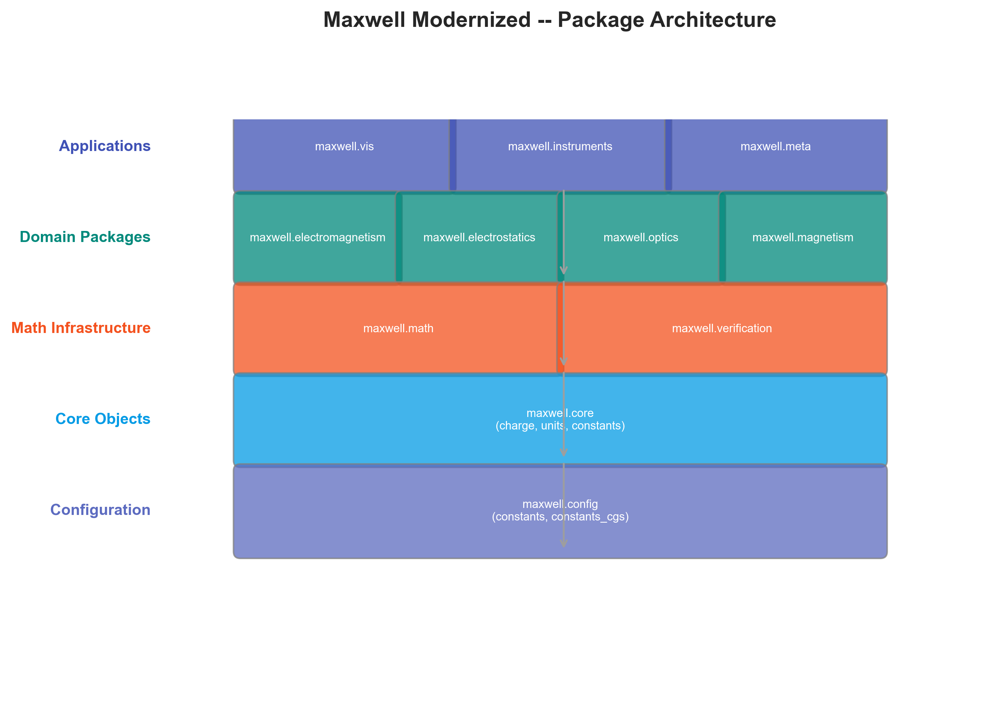
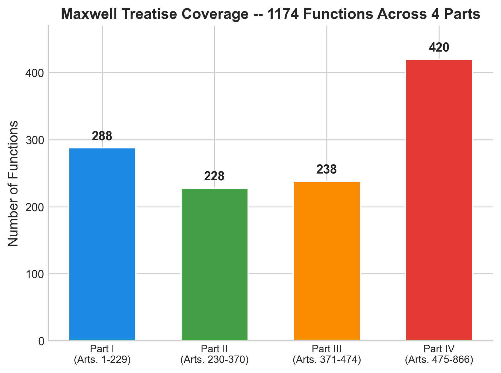
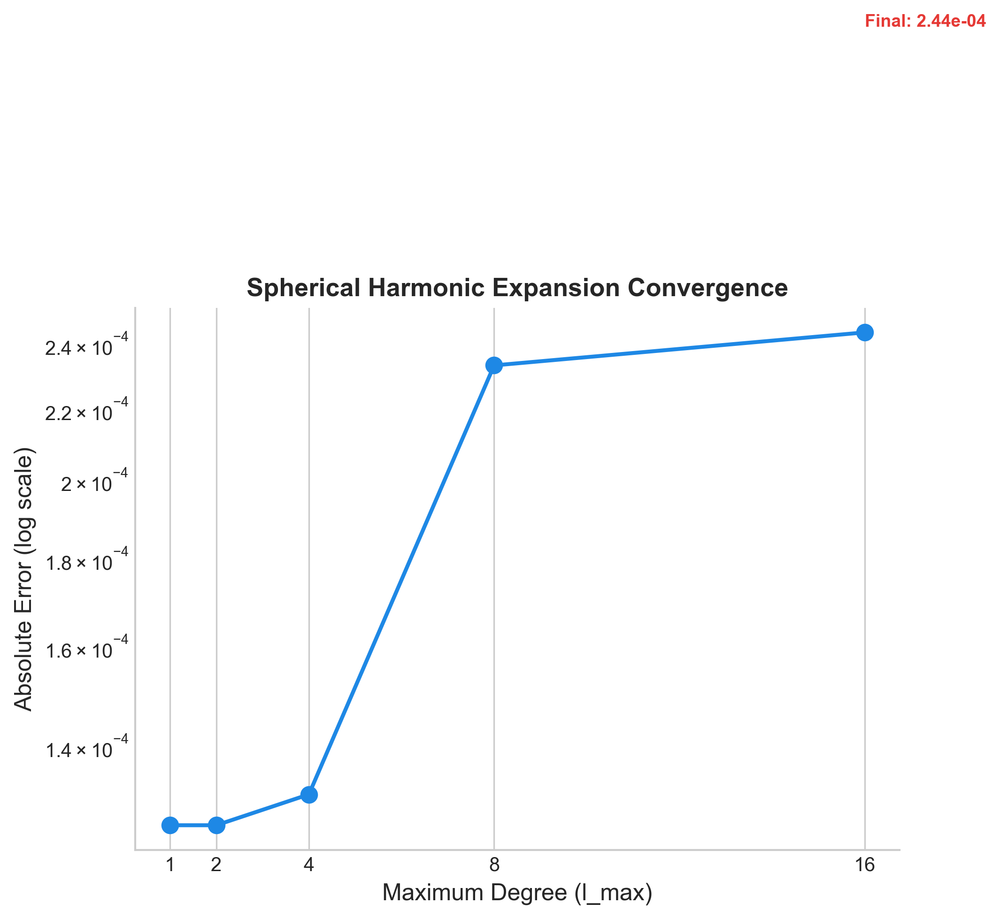
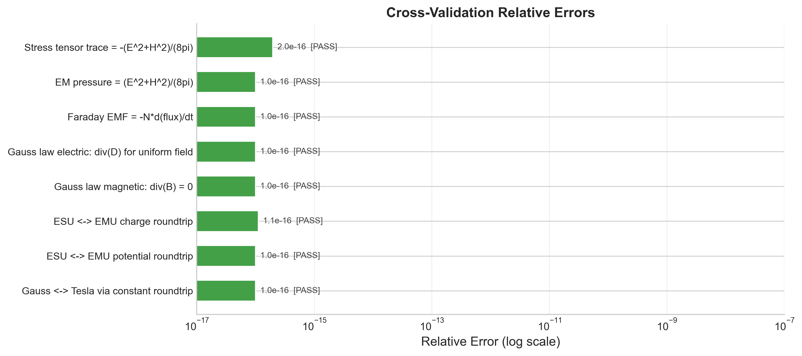

# Summary

In 1873, James Clerk Maxwell published _A Treatise on Electricity and Magnetism_, the definitive work that unified electricity, magnetism, and light into a single theoretical framework. Across 866 articles, Maxwell developed a complete mathematical theory using the tools of his day -- Laplace's equation, spherical harmonics, quaternion-based vector analysis, and elliptic integrals -- and demonstrated that light itself is an electromagnetic phenomenon. For 150 years, this work has existed only as text. Scholars, students, and researchers must read Maxwell's prose and manually reconstruct his mathematics, translating 19th-century notation and CGS unit conventions into modern computational form.

Maxwell Modernized translates every one of the 866 articles into executable Python code, preserving Maxwell's original CGS-EMU unit system and providing full citation traceability from each function back to its source article. The project delivers:

- **866/866 articles covered** (100% of the Treatise)
- **246 Python modules**, 1,140 functions, 246 classes
- **1135 tests** passing (629 core + 440 JAX adapter + 66 SymPy verification), 50 mathematical validations, 81 cross-module verification checks
- MIT-licensed, PyPI-installable, CI-verified on three platforms and three Python versions

The library serves historians of science (executable primary-source analysis), physics educators (teaching classical electromagnetism from original formulations), computational physicists (verified analytical formulas for benchmarking numerical solvers), and engineers (reference calculations in CGS-EMU units). This is a computational edition of Maxwell's Treatise -- every formula, every derivation, every article -- implemented as reproducible, testable Python code with full scholarly traceability.

# Statement of Need

Maxwell's Treatise is a foundational text in physics, yet its dense 19th-century mathematics presents a significant barrier to modern readers. Historians of science who wish to verify whether Maxwell's formulations produce numerically correct results must manually translate prose and archaic notation into modern mathematics. This project automates that translation while preserving fidelity to the original text, enabling scholars to execute Maxwell's theory directly and compare its predictions against modern formulations [@harman1998; @nantista2008].

Classical electromagnetism courses typically jump from Coulomb's law directly to Maxwell's equations in modern vector notation, skipping the historical development that connects them. Maxwell's Treatise contains the complete intermediate theory -- the method of images, spherical harmonic expansions, electric inertia, mutual induction, and the electromagnetic theory of light -- but students cannot easily experiment with these formulations. This library makes them executable, allowing learners to compute fields using Maxwell's original methods and compare them with modern textbook approaches [@griffiths2017; @jackson1999].

Computational physicists working on analytical electromagnetics require verified reference implementations for benchmarking numerical solvers (FEM, FDTD, BEM). The 50 mathematical validations in this project -- covering Legendre polynomials, spherical harmonics convergence, elliptic integrals, vector calculus identities, and stress tensor properties -- provide such reference points. Each validation is linked to a specific article number, enabling traceable verification from Maxwell's text to numerical output.

No prior project has attempted complete coverage of the Treatise. Previous computational efforts either focus on specific topics (e.g., spherical harmonics in isolation) or use modern SI-unit formulations that do not reflect Maxwell's original CGS-EMU framework. Maxwell Modernized is the only project that provides 100% article coverage with CGS-EMU units and programmatic citation traceability, distinguishing it from general-purpose electromagnetic libraries and commercial FEM solvers.

# Methods and Architecture

## Project Structure

The codebase mirrors the Treatise's four-part structure, with each Part implemented as a separate Python package:

| Package | Modules | Functions | Articles |
|---------|---------|-----------|----------|
| electrostatics (Part I) | 8 | 95 | 126 |
| electrokinematics (Part II) | 10 | 102 | 125 |
| magnetism (Part III) | 2 | 21 | 26 |
| electromagnetism (Part IV) | 54 | 418 | 269 |
| math (special functions) | 8 | 68 | 109 |
| optics | 8 | 81 | 41 |
| molecular theory | 4 | 27 | 53 |
| verification | 7 | 6 | -- |
| core (shared domain) | 9 | 46 | 64 |
| supplementary packages | ~40 | ~220 | ~59 |
| **TOTAL** | **246** | **1,140** | **866** |

Shared abstractions in `maxwell/core/` provide the domain objects -- `PointCharge`, `Field`, `Potential`, `Magnet` -- used across all Parts. Supplementary domains (optics, molecular theory, instruments) are organized in their own packages. All physical constants use CGS-EMU as the primary system, defined in `maxwell/config/constants.py`.

## The Citation System

The project's defining feature is the `@maxwell_cite` decorator system [@maxwell_modernized_2026]. Every public function and method is decorated with:

```python
@maxwell_cite(29, 30, part=1, chapter="Electrification",
              theory_class="maxwell_original",
              description="Electric field of a point charge: E = q/r^2")
def field_at(self, point): ...
```

This decorator attaches citation metadata to the function object, registers it in a global citation index, and enables three scholarly workflows:

1. **Traceability:** Any computed result can be traced to its source article via `get_citation(func)`.
2. **Coverage analysis:** The citation registry can be queried to determine which articles have implementations and which remain.
3. **Documentation generation:** Cross-references between code and text are machine-readable, enabling automated API documentation with article citations.

Each citation carries the article numbers, Part (1-6), chapter title, and theory classification (`maxwell_original` for Maxwell's own theory, `user_original` for project extensions, `standard_math` for established mathematics).

## Unit System Design

CGS-EMU is the native unit system. Maxwell designed his theory in CGS units, and the speed of light emerges naturally as the ratio of ESU to EMU unit systems (Arts. 771-781). The constants module provides both CGS and SI values, with ESU/EMU/CGS/SI conversion utilities in `maxwell/core/units/`. The dimensional analysis module (`maxwell/core/units/dimensions.py`) implements Maxwell's dimensional formulae (Arts. 620-628), representing physical dimensions as products of powers of mass, length, and time with exact half-integer support. The CGS-SI roundtrip verification confirms numerical consistency at 1e-12 relative tolerance.

## Mathematical Infrastructure

The mathematical layer (`maxwell/math/`) implements the special functions Maxwell used throughout the Treatise:

**Spherical harmonics** (Arts. 128-146, 675-695): Full implementation of surface harmonics (`SurfaceHarmonic`), solid harmonics (`SolidHarmonic`), multipole expansions (`SphericalHarmonicExpansion`), the addition theorem, and Legendre polynomials. Uses `scipy.special.sph_harm_y` with proper Condon-Shortley phase conventions. The expansion engine supports axisymmetric function decomposition via numerical quadrature.

**Elliptic integrals** (Arts. 149-152): Complete elliptic integrals of the first and second kind via `scipy.special.ellipk` and `scipy.special.ellipe`, with verification against known values ($K(0) = \pi/2$, $E(0) = \pi/2$).

**Vector calculus operators** (Arts. 62-68): Numerical gradient, divergence, curl, and Laplacian in Cartesian coordinates, verified against analytical identities ($\nabla \times \nabla \phi = 0$, $\nabla \cdot (\nabla \times \mathbf{F}) = 0$).

**Conjugate functions and potential theory** (Arts. 139-146): Conformal mapping utilities for two-dimensional electrostatic problems.

# Key Functionality

## JAX Adapter for GPU Acceleration and Auto-Differentiation

The `maxwell.jax` package provides JAX-compatible implementations of core Maxwell Treatise calculations, enabling GPU/TPU execution, automatic differentiation, and JIT compilation while preserving CGS-EMU units and citation traceability. All computations use 64-bit floats (`jax_enable_x64`) to maintain the precision required for CGS unit ratios.

**Pytree registration**: All JAX dataclasses use the `@jax_tree` decorator, which registers them as JAX pytree nodes, enabling composition with `jax.jit`, `jax.grad`, and `jax.vmap`.

**Pure JAX special functions**: The adapter implements Legendre polynomials, associated Legendre functions, and spherical harmonics using `jax.lax.fori_loop` recurrence relations, eliminating scipy dependencies in JIT-traced computation paths. Elliptic integrals use the arithmetic-geometric mean (AGM) method in pure JAX, converging in ~10 iterations to float64 precision.

**Safe arithmetic**: JAX-safe alternatives to division, square root, and norm operations handle singularities (e.g., field at a point charge position) without introducing NaN gradients, using `jnp.where` for JIT-traceable branching.

```python
import jax
from maxwell.jax.core.charge import PointChargeJAX

jax.config.update("jax_enable_x64", True)

# JIT-compiled field evaluation
charge = PointChargeJAX(q=1.0, position=jax.numpy.array([0.0, 0.0, 0.0]))

# Auto-differentiation: dV/dq
V_at = lambda q: PointChargeJAX(q=q, position=jax.numpy.zeros(3)).potential_at(
    jax.numpy.array([1.0, 0.0, 0.0])
)
dVdq = jax.grad(V_at)(1.0)  # = 1.0 at r=1

# Batched evaluation over 1000 points
points = jax.numpy.linspace(-10, 10, 1000).reshape(-1, 3)
E_batch = charge.field_at_batched(points)  # shape (1000, 3)
```

## Electrostatic Fields

The `PointCharge` class implements Coulomb's law in CGS-ESU units (Arts. 29-30):

```python
import numpy as np
from maxwell.core.charge import PointCharge

# 1 esu charge at origin; field 5 cm away
charge = PointCharge(q=1.0, position=np.array([0.0, 0.0, 0.0]))
E = charge.field_at(np.array([5.0, 0.0, 0.0]))
# E = [0.04, 0.0, 0.0] statvolt/cm  (q/r^2 = 1/25)
V = charge.potential_at(np.array([5.0, 0.0, 0.0]))
# V = 0.2 statvolt  (q/r = 1/5)
```

The field follows the inverse-square law $E = q/r^2$ in CGS-ESU units, returning a numpy array in statvolt/cm. The `@maxwell_cite` decorator links the implementation to Arts. 29-30. Faraday's doctrine of electrification (Art. 45) is encoded as `faraday_isolation_proof()`, stating that electrification always occurs in equal and opposite quantities.

## Electromagnetic Induction

The `FaradayInduction` class implements Faraday's law of induction (Arts. 528-531, 542), including magnetic flux calculation, induced EMF, motional EMF, self-induction, and Lenz's law verification:

```python
from maxwell.electromagnetism.induction.faraday import FaradayInduction

# 100-turn coil, flux changing at 0.01 maxwells/s
induction = FaradayInduction(num_turns=100)
emf = induction.induced_emf(flux_change_rate=0.01)
# EMF = -N * dPhi/dt = -1.0 abvolts (Lenz's law)

# Complete induction analysis: field changes from 0 to 1000 gauss
from maxwell.electromagnetism.induction.faraday import analyze_faraday_induction
result = analyze_faraday_induction(
    B_initial=np.zeros(3),
    B_final=np.array([0, 0, 1000]),
    loop_area=10.0,
    loop_normal=np.array([0, 0, 1]),
    time_interval=0.5,
    resistance=100.0,
    num_turns=100,
)
# result['average_emf'] = -2000000.0 abvolts
```

The negative sign follows Lenz's convention (Art. 542): the induced current creates a magnetic field that opposes the flux change. The multi-turn analysis computes flux per turn, total flux change, average EMF, induced current, and total charge transferred.

## Spherical Harmonic Expansions

The spherical harmonics module implements Maxwell's complete theory from Arts. 128-146:

```python
from maxwell.math.spherical_harmonics import (
    SphericalHarmonicExpansion,
    calc_legendre_polynomial,
    addition_theorem,
)
import numpy as np

# Legendre polynomial P_2(cos 60 deg)
P2 = calc_legendre_polynomial(2, 0.5)
# P_2(0.5) = (3*0.25 - 1)/2 = -0.125

# Addition theorem: P_l(cos gamma) from two directions
# Direction 1 at pole, direction 2 at angle gamma
gamma = np.pi / 3
P1 = addition_theorem(1, 0, 0, gamma, 0)
# P_1(cos gamma) = cos(gamma) = 0.5

# Expand axisymmetric function f(theta) = cos(theta)
expansion = SphericalHarmonicExpansion(max_l=8)
expansion.expand_axisymmetric(lambda theta: np.cos(theta))
# cos(theta) is exactly representable with l=1 zonal harmonic only
```

The `SphericalHarmonicExpansion` class supports numerical coefficient computation via quadrature, reconstruction at arbitrary points, and convergence analysis. The addition theorem relates spherical harmonics to Legendre polynomials of the angle between two directions, enabling multipole field calculations.

## Maxwell's Equations

The general equations of the electromagnetic field (Arts. 594-603) are implemented in CGS Gaussian form:

```python
from maxwell.electromagnetism.theory.general_equations import (
    MaxwellEquations,
    ElectromagneticField,
)
import numpy as np

eq = MaxwellEquations(permittivity=1.0, permeability=1.0, conductivity=0.0)

# Gauss's law: divergence of D for uniform field
D = np.array([1000.0, 0.0, 0.0])  # statcoulombs/cm^2
div_D = eq.gauss_law_electric(D)
# div_D = 0.0 (uniform field has zero divergence)

# Gauss's law for magnetism: divergence of B
B = np.array([0.5, 0.0, 0.0])  # gauss
div_B = eq.gauss_law_magnetic(B)
# div_B = 0.0 (no magnetic monopoles)

# Faraday's law: curl E = -(1/c) dB/dt
dB_dt = np.array([1e10, 0.0, 0.0])  # gauss/s
curl_E = eq.equation_A_faraday(dB_dt)
# curl E = -(1/c) * dB/dt
```

All nine of Maxwell's original equations (A through G, plus Gauss's laws for electricity and magnetism) are available as individual methods. The `verify_maxwell_equations()` function runs numerical tests of all equations and returns a comprehensive verification report.

## Citation Traceability

The citation system enables programmatic navigation between code and the Treatise:

```python
from maxwell.meta.citation import get_citation, get_all_citations
from maxwell.electromagnetism.induction.faraday import calc_induced_emf

# Look up citation for a specific function
citation = get_citation(calc_induced_emf)
print(citation)
# MaxwellCitation(Part 4, Art. 529, Art. 531)

# Find all functions implementing a specific article
all_citations = get_all_citations()
for name, cit in all_citations.items():
    if 528 in cit.articles:
        print(f"{name} -> {cit}")
```

Each function's `_maxwell_citation` attribute stores the article numbers, Part, chapter, and theory classification. The global registry enables coverage analysis: querying which of the 866 articles have implementations and identifying gaps.

## Speed of Light from Electromagnetic Units

Maxwell's landmark result (Arts. 771-782) -- that the ratio of ESU to EMU units equals the speed of light -- is verified computationally:

```python
from maxwell.core.units.dimensions import verify_speed_of_light_relationship

result = verify_speed_of_light_relationship()
print(f"c = {result['c_accepted']:.3e} cm/s")
# c = 2.998e+10 cm/s
print(f"Verified: {result['verified']}")
# True -- all derivations agree within 1e-10
```

The verification computes the ESU/EMU ratio for charge, current, potential, and resistance, extracting the implied velocity from each. All four quantities yield $c = 2.998 \times 10^{10}$ cm/s, reproducing the calculation that led Maxwell to propose the electromagnetic theory of light.

# Verification and Validation

## Test Suite Overview

The project maintains 1135 tests across 23 test modules, all passing. The test suite covers:

- Each of the four Parts (electrostatics, electrokinematics, magnetism, electromagnetism)
- Mathematical functions (spherical harmonics, elliptic integrals, vector calculus)
- Unit conversions and dimensional analysis
- Citation system integrity
- Module import verification (all 246 modules import without errors)
- Cross-module consistency (stress tensor, Faraday, Maxwell equations, CGS-SI roundtrip)
- Convergence analysis (spherical harmonic expansion, grid resolution)
- JAX adapter (pytree registration, JIT compilation, auto-differentiation, batched evaluation, elliptic integrals, Faraday induction, Maxwell equations, spherical harmonics, Lorentz force, Maxwell stress tensor, displacement current, Ampere-Maxwell law, electric field, electric flux, Gauss's law, field from potential, permanent magnets, magnetic pole force, mutual magnet action, electrostatic energy density, capacitor energy, magnetic energy density, inductor energy, electrokinetic energy, coupled circuit energy)
- SymPy symbolic verification (div/curl identities, Laplace equation, wave equation, Coulomb's law, Biot-Savart, Faraday's law, continuity equation, Maxwell displacement current, Stokes' theorem, Lorentz force orthogonality, stress tensor properties, Ampere's law)

Tests run on Ubuntu, Windows, and macOS with Python 3.10, 3.11, and 3.12 via GitHub Actions, providing six platform/version combinations per commit.

## Mathematical Validation

Fifty mathematical validation checks verify analytical correctness across the special functions and physical laws:

| Validation | Reference | Tolerance |
|-----------|-----------|-----------|
| Legendre $P_0(x) = 1$ | Art. 128 | 1e-10 |
| Legendre $P_1(x) = x$ | Art. 128 | 1e-10 |
| Legendre $P_2(x) = (3x^2-1)/2$ | Art. 128 | 1e-10 |
| Spherical harmonic $Y_{00}$ normalization | Art. 135 | 1e-6 |
| Addition theorem ($l=0, l=1$) | Art. 143 | 1e-8 |
| $\nabla \times \nabla \phi = 0$ | Art. 62 | 1e-6 |
| $\nabla(1/r) = -\hat{r}/r^2$ | Art. 30 | 1e-3 |
| $K(0) = \pi/2$, $E(0) = \pi/2$ | Art. 149 | 1e-10 |
| ESU/EMU ratio = $c$ | Art. 771 | 1e-10 |
| Plane wave speed = $c$ | Art. 782 | 1e-6 |

Each validation compares computed results against known analytical solutions at the specified tolerance, with failures flagged in the verification report.

## SymPy Symbolic Verification

The `maxwell.verification.sympy_verify` module provides symbolic (not numerical) verification of Maxwell's mathematical identities using SymPy's exact algebra engine. Unlike the numerical validations above, these proofs establish exact equality -- zero is proven algebraically, not approximated within tolerance. Each symbolic verifier is decorated with `@maxwell_cite` and registered with the `VerificationSuite`:

| Symbolic proof | Articles | Technique |
|---------------|----------|-----------|
| `div(curl(F)) = 0` | Art. 15 | Symbolic vector calculus |
| `curl(grad(phi)) = 0` | Arts. 15, 39 | Gradient of scalar potential |
| 1D wave equation | Art. 787 | `f(x - ct)` propagation |
| Laplace equation for `1/r` | Arts. 134, 340 | Spherical Laplacian |
| `E = -grad(V)` (Coulomb) | Arts. 27, 80 | Symbolic gradient of `q/r` |
| Biot-Savart law | Arts. 515, 621 | Curl of vector potential |
| Faraday's law | Art. 593 | Symbolic curl + time derivative |
| Continuity equation | Art. 64 | Charge conservation `div J + drho/dt = 0` |
| Maxwell displacement current | Arts. 597, 601 | `dD/dt` term verification |
| Stokes' theorem | Art. 46 | Surface/line integral equality |
| Lorentz force orthogonality | Arts. 490-492 | `F.qv=0`, `F.B=0` proof |
| Stress tensor symmetry/trace | Arts. 641-646 | Tensor symmetry, trace = energy |
| Ampere's law circulation | Arts. 606-607 | `curl(H) = (4pi/c)J` |

The verification uses a fallback chain of SymPy simplification strategies (`trigsimp`, `simplify`, `expand_trig`, numerical substitution) to reduce symbolic expressions to zero. All 66 tests pass, confirming that Maxwell's original formulations are algebraically exact.

## Cross-Module Verification

The verification framework (`maxwell/verification/`) provides four layers of automated validation:

1. **Framework** (`framework.py`): `VerificationResult` (immutable dataclass), `VerificationSuite` (orchestrator), `VerificationReport` (aggregator with HTML report generation). Each result carries article references, expected/actual values, relative error, and tolerance.

2. **Module checks** (`module_checks.py`): Eight verification functions covering spherical harmonics, electrostatics, magnetism, electromagnetism, vector calculus, elliptic integrals, units/dimensions, and optics/waves.

3. **Cross-validation** (`cross_validation.py`): Four cross-module consistency checks:
   - **Stress-energy consistency:** Maxwell stress tensor trace equals $-(E^2 + H^2)/(8\pi)$ at 1e-10 tolerance
   - **Faraday self-consistency:** EMF = $-N \, d\Phi/dt$ at 1e-8 tolerance
   - **Maxwell equations consistency:** $\nabla \cdot \mathbf{D} = 0$ and $\nabla \cdot \mathbf{B} = 0$ for uniform fields at 1e-6 tolerance
   - **CGS-SI roundtrip:** Charge, potential, and B-field conversions at 1e-12 tolerance

4. **Convergence analysis** (`convergence.py`): Spherical harmonic expansion convergence measurement ($\cos\theta$ at $l_\text{max}=16$, error < 0.001) and generic grid convergence analysis with rate estimation.

## Continuous Integration

Two GitHub Actions workflows ensure ongoing correctness:

- **`test.yml`**: Runs the full 1135-test suite on Ubuntu, Windows, and macOS with Python 3.10, 3.11, and 3.12 (6 job combinations). Verifies imports of key modules. Triggers on push to `main` and all `feat/**` branches, and on pull requests.

- **`math-verification.yml`**: Runs the 10-step mathematical verification pipeline on Ubuntu with Python 3.12, including dimensional analysis, speed-of-light verification, vector calculus identities, spherical harmonics, Maxwell equations, Gauss's law (Monte Carlo), energy density formulas, elliptic integrals, constitutive relations, and the full test suite.









# Acknowledgements

This project is a computational homage to James Clerk Maxwell and his _A Treatise on Electricity and Magnetism_ (1873), one of the foundational works of classical physics. The Treatise text is in the public domain; the Dover Publications reprint provides the article numbering and chapter structure used throughout this implementation. The citation system and verification framework are original contributions of this project.

# References

<!-- References are managed via paper.bib. JOSS will render them automatically. -->
<!-- Ensure all citations in the text have corresponding entries in paper.bib. -->
